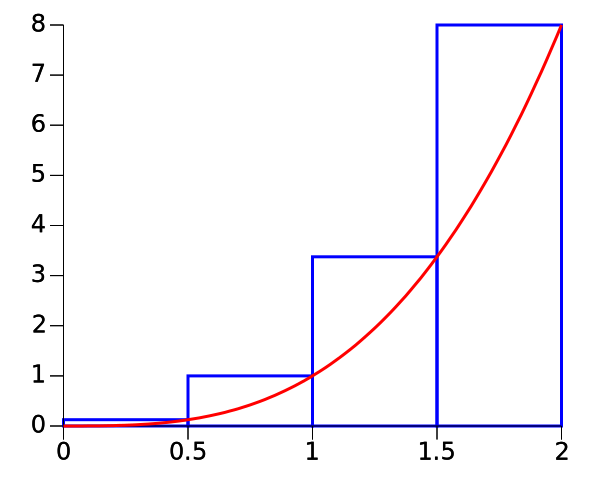

# Calculating Areas

## Reimann Sum

This is the mathematical term for breaking up an area into areas.
We will start with rectangles.

## Left Reimann sum


## Right Reimann sum



## Trapeziodal Riemann sum


<!-- # Introduction -->
<!--  -->
<!-- While we want to develop our intuition when we are estimating with large -->
<!-- numbers, performing accurate calculations is also important.  You will -->
<!-- be able to calculate these numbers on a hand&#45;held calculator, in Excel, -->
<!-- and using scientific computing platforms like Python. -->
<!--  -->
<!-- Since our calculations are often used as evidence to support an -->
<!-- argument, they must be easy to read and have clear methods and -->
<!-- assumptions.  Using a computer to preserve the details of the -->
<!-- calculation is often preferable to using a calculator. -->
<!--  -->
<!-- We will start with concepts most familiar to you from your work with -->
<!-- calculators and we will build more concepts on that knowledge. -->
<!--  -->
<!-- # Basic Concepts -->
<!--  -->
<!-- &#45; Computing platforms -->
<!-- &#45; Computing languages -->
<!-- &#45; Arithmetic operations -->
<!-- &#45; Variables -->
<!-- &#45; Functions -->
<!--  -->
<!-- ## Computing platforms -->
<!--  -->
<!-- &#45; You are likely most familiar with a calculator -->
<!-- &#45; You enter a series of commands -->
<!-- &#45; When you press enter or equals, they are sent to a small computer for -->
<!--     evaluation -->
<!-- &#45; The results are printed for you -->
<!-- &#45; There are many computer programs that do similar things and allow much -->
<!--     more power and flexibility -->
<!-- &#45; Other platforms are Mathematica and spreadsheets -->
<!--  -->
<!-- ## Basic computations -->
<!--  -->
<!-- &#45; Addition (+) -->
<!-- &#45; Subtraction (&#45;) -->
<!-- &#45; Multiplication (*) -->
<!-- &#45; Division (/) -->
<!-- &#45; Exponentiation (^ or **) -->
<!--  -->
<!-- To perform basic calculations with numbers, we can type numbers into the -->
<!-- computer and use the symbols above to perform the calculation. -->
<!--  -->
<!-- ## Computing languages -->
<!--  -->
<!-- &#45; Computing languages allow us to instruct the computer to do things -->
<!-- &#45; As our models and computations become more complex, we will want to do -->
<!--     things besides addition and multiplication -->
<!-- &#45; Using a computing language helps us achieve that -->
<!--  -->
<!-- ## Variables -->
<!--  -->
<!-- To make the details of a computation more clear, we can use readable -->
<!-- names for our numbers and then use the names in the calculation. -->
<!--  -->
<!-- ``` -->
<!-- power = 100 -->
<!-- time = 30 -->
<!-- energy = power * time -->
<!-- ``` -->
<!--  -->
<!-- &#45; This makes the intention of the calculation more clear to the reader. -->
<!-- &#45; This also allows us to reuse what we have typed and change our numbers -->
<!--     easily to repeat a similar calculation -->
<!--  -->
<!-- ## Functions -->
<!--  -->
<!-- You have often used functions on your calculator and you have -->
<!-- encountered the idea in your math classes. -->
<!--  -->
<!-- A function takes a number or numbers as an input and provides a number -->
<!-- or numbers as an output. -->
<!--  -->
<!-- You have probably used sine or cosine functions on your calculator. -->
<!--  -->
<!-- You may want to make your own function for a calculation that you do -->
<!-- frequently.  The syntax for this often varies but the idea is usually -->
<!-- the same. -->
<!--  -->
<!-- ``` -->
<!-- m = 1 -->
<!-- b = 10 -->
<!-- f(x) = m * x + b -->
<!-- f(5) => 15 -->
<!-- ``` -->
<!--  -->
<!-- ## Print Function -->
<!--  -->
<!-- Computer functions can take many things besides numbers as input and do -->
<!-- many things besides return numbers as output.  The print function is -->
<!-- very useful.  Provided with text or variables, it will output things to -->
<!-- the screen. -->
<!--  -->
<!-- ``` -->
<!-- estimate = 20 -->
<!-- print('My estimate: ', estimate) -->
<!--  -->
<!-- > My estimate: 20 -->
<!-- ``` -->
<!--  -->
<!-- # Jupyter Concepts -->
<!--  -->
<!-- &#45; Markup and Markdown -->
<!-- &#45; Markup and LaTeX -->
<!-- &#45; Python -->
<!-- &#45; Jupyter -->
<!--  -->
<!-- ## Python -->
<!--  -->
<!-- Python is a general purpose language that can be used for calculations. -->
<!-- You can find more information about Python -->
<!-- [here](https://docs.python.org/3/tutorial/introduction.html) -->
<!--  -->
<!-- ## Jupyter -->
<!--  -->
<!-- &#45; Jupyter is like a word processor and spreadsheet in one program -->
<!-- &#45; By mixing words and computations together, you can clearly explain -->
<!--     your approach to an estimation -->
<!-- &#45; It has blocks or cells of text that are sent to the program of your -->
<!--     choice to be interpreted -->
<!-- &#45; Markdown: our word processor -->
<!-- &#45; Python: our spreadsheet or computation program -->
<!-- &#45; You press shift&#45;enter to evaluate a cell -->
<!--  -->
<!-- ## Markdown -->
<!--  -->
<!-- &#45; You can think of this as a word processor -->
<!-- &#45; By selecting markdown as the type of cell, jupyter sends the text to -->
<!--     markdown to be interpreted -->
<!-- &#45; Special characters are use to tell the computer to make headings or -->
<!--     bold characters -->
<!--  -->
<!-- ## LaTeX -->
<!--  -->
<!-- &#45; This is a word processor especially for math -->
<!-- &#45; By placing dollar signs ($) around some text, it is sent to LaTeX to -->
<!--     be interpreted -->
<!-- &#45; You can use this to write fractions and many other mathematical -->
<!--     symbols -->
<!-- &#45; You can find some symbols at this -->
<!--     [link](http://estudijas.lu.lv/pluginfile.php/14809/mod_page/content/16/instrukcijas/matematika_moodle/LaTeX_Symbols.pdf) -->
<!--  -->
<!-- For example -->
<!--  -->
<!-- ``` -->
<!-- \frac{1}{2} -->
<!-- ``` -->
<!--  -->
<!-- will turn into -->
<!--  -->
<!-- $$\frac{1}{2}$$ -->
<!--  -->
<!--  -->
<!-- ## SageMathCloud -->
<!--  -->
<!-- We use SageMathCloud to provide an easy&#45;to&#45;use platform for our -->
<!-- computations -->
<!--  -->
<!-- &#45; Create an account at Sage Math Cloud -->
<!-- &#45; Use your nice_person@sonoma.edu email address -->
<!--  -->
<!-- &#45; We will add you to our class -->
<!-- &#45; You will be able to access class content and various tools -->
<!--  -->
<!-- ## Pint Unit Library -->
<!--  -->
<!-- &#45; By using the Pint library you can include units in your Python -->
<!--     calculations. -->
<!-- &#45; You can learn more about Pint by a Google search or -->
<!--     [here](https://pint.readthedocs.org/) -->
