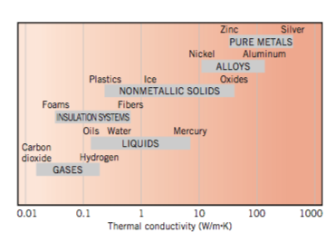
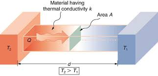
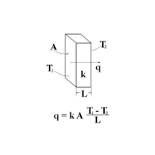
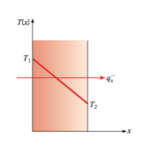

# Conduction

## Concepts

- R-value
- U-value
- Fourier's Law

## Thought experiment

Given a block of material sitting between two temperatures, what heat
flow do you expect?

## Fourier's Law

$$ q_x = -kA\frac{\Delta T}{\Delta x} $$

- $$q_x$$ dimensions of energy per time or power
- $$A$$ dimensions of area
- $$k$$ dimensions of power per distance per degree
- $$\Delta T$$ is the temperature difference
- $$\Delta x$$ is the thickness of the material

## Fourier's Law Differential Form

$$ q_x = -k \frac{dT}{dx} $$

$$ q = -k \nabla T $$

- $$q_x$$ dimensions of power per unit area
- $$k$$ dimensions of power per distance per degree

## Fourier's Law, Buildings Form

$$ Q = U A \Delta T $$

- $$Q$$ heat transfer dimensions of power
- $$U$$ dimensions of power per area per degree temperature
- $$A$$ dimension of area
- $$T$$ dimension of temperature

## Conductivity

## R value and U value

- Building materials publish an R-value
- Sometimes published as a U-value

## Conduction

## Conduction

## Conduction

## Units

- in US units R value is $$ft^2 \circ F / BTU per hour$$
- in SI units R value is $$m^2 K / watt $$

## Parallel

- If you have two conducting surfaces in parallel, the U-values add
- In parallel, the heat can take either path

## Series

- If you have two conducting surfaces in series, the U-values add
    according to
$$ U_{total} = \left(\frac{1}{U_1} + \frac{1}{U_2}\right)^{-1} $$
- In series, the heat must take both paths

## Learning Objectives

- Make calculations of R values

## Activity R-Value of SIP

- Are the components of the SIP in parallel or series?
- How do we find the properties of each?

## Typical R and U values

- Window range (US R-values)
    - R-1 for single pane
    - R-12.5 for more advanced windows
- Wall range
    - R-3.4 (2x4 no inssulation)
    - R-12.7 (2x4 R-13 insulation)
    - R-34.6 (2x6 R-21 insulation)

## Estimate Wall Loss in ETC

- What is the R-value?
- What is the total area of walls?

## Wall Example

- Wood 0.15 watts per kelvin per meter
- Polyurethane foam 0.02 watts per kelvin per meter
- [Conductivities](https://en.wikipedia.org/wiki/List_of_thermal_conductivities)
- 4.5 inch panel 13.8 R value

## Calca

    k_wood = 0.15 W/K/m
    k_foam = 0.02 W/K/m
    t_wood = 0.01 m
    t_foam = 0.08 m

    r_wood = t_wood/k_wood => 0.0667 m^2*K/W
    r_foam = t_foam/k_foam => 4 m^2*K/W

    r_SIP_SI = 2 * r_wood + r_foam => 4.1333 m^2*K/W

    r_SIP_US = r_SIP_SI * 5.68 ft^2/m^2*F/K*W/BTU => 23.4773 ft^2*F/BTU

## Bathtub model of heat flow

- What is the input?
- Now the drain is faster with greater temperature

