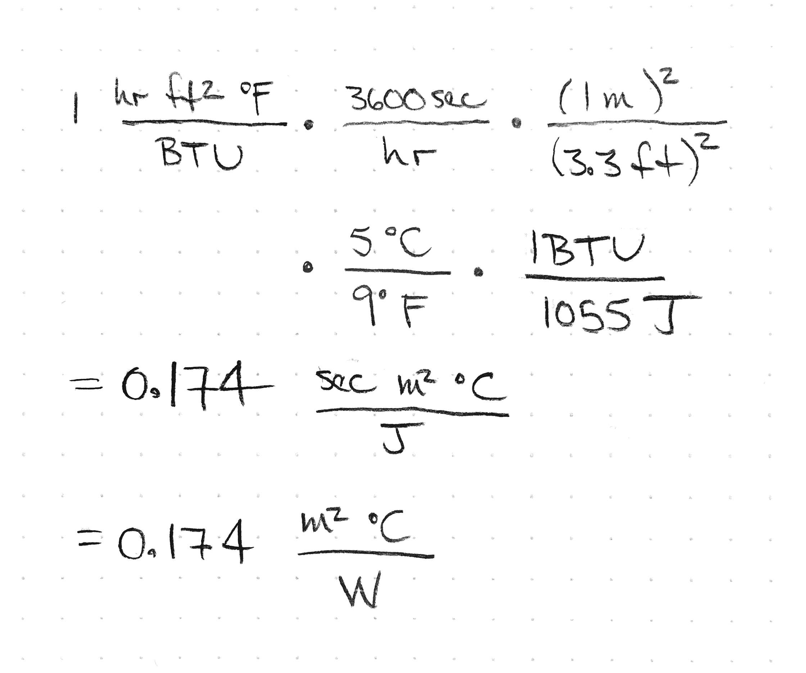

# Conduction

## Concepts

- R-value
- U-value
- Fourier's Law

## Thought experiment

Given a block of material sitting between two temperatures, what heat
flow do you expect?

## Fourier's Law

$$ q_x = -kA\frac{\Delta T}{\Delta x} $$

- $$q_x$$ dimensions of energy per time or power
- $$A$$ dimensions of area
- $$k$$ dimensions of power per distance per degree
- $$\Delta T$$ is the temperature difference
- $$\Delta x$$ is the thickness of the material

## Fourier's Law Differential Form

$$ q_x = -k \frac{dT}{dx} $$

$$ q = -k \nabla T $$

- $$q_x$$ dimensions of power per unit area
- $$k$$ dimensions of power per distance per degree

## Fourier's Law, Buildings Form

$$ Q = U A \Delta T $$

- $$Q$$ heat transfer dimensions of power
- $$U$$ dimensions of power per area per degree temperature
- $$A$$ dimension of area
- $$T$$ dimension of temperature

## Conductivity


## R value and U value

- Building materials publish an R-value
- Sometimes published as a U-value


## Conduction


## Conduction


## Conduction


## Units

- in US units R value is $$ft^2 \circ F / BTU per hour$$
- in SI units R value is $$m^2 K / watt $$

## Parallel

- If you have two conducting surfaces in parallel, the U-values add
- In parallel, the heat can take either path

## Series

- If you have two conducting surfaces in series, the U-values add
    according to
$$ U_{total} = \left(\frac{1}{U_1} + \frac{1}{U_2}\right)^{-1} $$
- In series, the heat must take both paths

## Bathtub model of heat flow

- What is the input?
- Now the drain is faster with greater temperature


## Typical R and U values

- Window range (US R-values)
    - R-1 for single pane
    - R-12.5 for more advanced windows
- Wall range
    - R-3.4 (2x4 no inssulation)
    - R-12.7 (2x4 R-13 insulation)
    - R-34.6 (2x6 R-21 insulation)


## Cylindrical Insulator

Note that this R does not have the same dimensions as R-value.
It has dimensions of temperature difference per unit power.


## Spherical Insulator

Note that this R does not have the same dimensions as R-value.
It has dimensions of temperature difference per unit power.


## Typical UA values

- Residential Home ?
- Commercial Building ?
- Cooler ?
- Down Jacket ?

# Activities


## R-Value of SIP

- Are the components of the SIP in parallel or series?
- How do we find the properties of each?


- Wood 0.15 watts per kelvin per meter
- Polyurethane foam 0.02 watts per kelvin per meter
- [Conductivities](https://en.wikipedia.org/wiki/List_of_thermal_conductivities)
- 4.5 inch panel 13.8 R value


```
k_wood = 0.15 W/K/m
k_foam = 0.02 W/K/m
t_wood = 0.01 m
t_foam = 0.08 m

r_wood = t_wood/k_wood => 0.0667 m^2*K/W
r_foam = t_foam/k_foam => 4 m^2*K/W

r_SIP_SI = 2 * r_wood + r_foam => 4.1333 m^2*K/W

r_SIP_US = r_SIP_SI * 5.68 ft^2/m^2*F/K*W/BTU => 23.4773 ft^2*F/BTU
```

## Convert R-values

Convert between a US R-value and a metric R-value.



Once you learn how to do this, you can use the value you calculate as a
conversion factor.  This will help you convert more quickly.


## Estimate Wall Loss in ETC

- What is the R-value?
- What is the total area of walls?
- How much power do we need to maintain the ETC one degree above the
    outside temperature?

## Calculus Approach to Heat Loss through conduction

We calculate the temperature as a function of time of a heated object
that loses heat to its surroundings through an insulation.  We start
with a lumped mass approximation with conductive heat loss through an
insulator.  Using the heat capacity of the object we have the relation

$$ C = \frac{Q}{\Delta T} $$

Where $$C$$, the heat capacity is the product of the density, $$\rho$$,
the volume of the object $$V$$, and the specific heat capacity of the
material $$c$$.

$$ C = \rho V c $$

Over a small time interval $$dt$$, the heat lost by the object as heat
conducts away is the product of the temperature difference $$T - T_C$$,
the thermal conductivity of the insulation, $$K$$ and the time interval
$$dt$$.

$$ Q = K (T - T_C) dt $$

Substituting, we get

$$ \rho V c = K (T - T_C) dt/dT $$

which we rearrange and integrate

$$ \int_{0}^{t} \frac{K}{\rho V c} dt = \int_{T_0}^{T} \frac{dT}{T - T_C} $$

with initial conditions $$T = T_0$$ at $$t=0$$ and $$T=T$$ at $$t=t$$.  Integrating, we get

$$ \frac{K}{\rho V c} t \bigg|_0^t =  \ln(T - T_C) \bigg|_{T_0}^{T}$$

$$ \frac{K}{\rho V c} t =  \ln(\frac{T - T_C}{T_0 - T_C}) $$

We exponentiate both sides and get

$$ \exp(-\frac{K}{\rho V c} t) =  \frac{T - T_C}{T_0 - T_C} $$

$$ T = (T_0 - T_C) \exp (-\frac{K}{\rho V c} t) + T_C $$

The equation shows an exponential decay in temperature starting at
$$T_0$$, the initial temperature of the object, decaying to $$T_C$$.

## Discrete approach

We can also do this numerically with a discrete time period.
