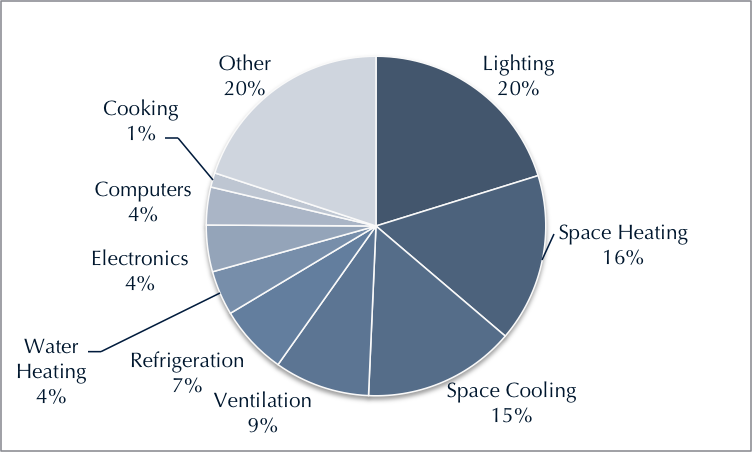
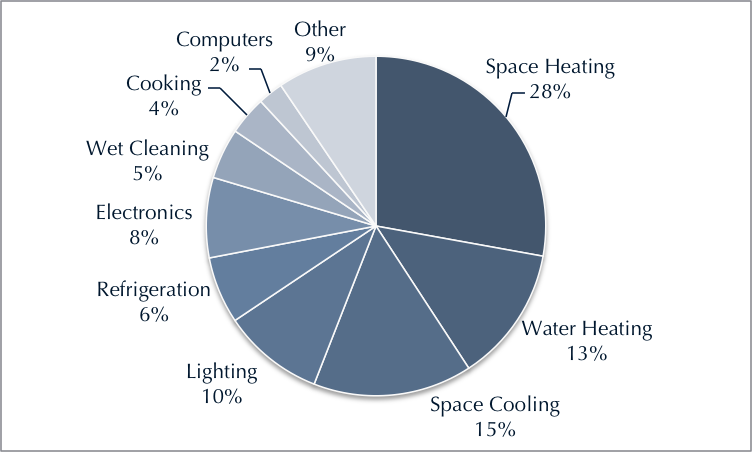
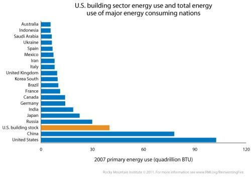

This course discusses how the fundamental mechanisms of thermal energy generation and transfer influence human society.

A significant fraction of our carbon emissions are from keeping the temperature of our buildings different than the outside temperature.
Also, thermal processes dictate the efficiency of combustion engines and many electrical power plants.

Mastery of these concepts allows us to create dwellings and systems that provide the benefits we require with the minimum carbon emissions and disruption to our climate.

In cold climates, energy bills from heating can be a significant financial burden on lower-income households.
Some areas run programs that simultaneously address these problems of income and energy while providing job training for under-employed areas.

Importantly, the mechanisms of climate change can be understood through the mechanisms of heat transfer.
Sunlight warms our earth, which "glows" thermal radiation which is reflected by the carbon dioxide in the atmosphere back to the earth.
This effect helps make the earth inhabitable, but adding too much carbon is trapping more warmth than we think is safe.

# US Commercial Building End Use

In commercial buildings, energy related to heat energy generation or movement is about 40% of the total usage in the building.

# US Residential Building End Use

In residential buildings these heat energy related uses are two thirds of the energy usage in the building.

# US Buildings

When we rank the energy extracted from the environment that is used in buildings in the US, it is more energy than several important countries.

# Videos

These three videos illustrate different aspects and benefits of work to reduce the energy required to deliver thermal services.

- [Sustainable Brewery](https://www.youtube.com/watch?v=Qv8gMuSVhvI)
- [ACEEE Efficiency Building Workers](https://www.youtube.com/watch?v=kLAp-69X4C4)
- [ACEEE West Virgina](https://www.youtube.com/watch?v=kHmxO9qS8U4)

What thermal physical models did you see illustrated?
What technologies, programs, or policies do you see?
What benefits do you see?

# Data Sources

What decisions do you want to make?
What data would support your decision?
Where can you find data online?

What are the best technologies to install in homes?

What are the health impacts of energy efficient buildings?

- EPA has programs
https://www.epa.gov/indoor-air-quality-iaq/health-energy-efficiency-and-climate-change

What are the learning impacts of energy efficient classrooms?

What are the best opportunities to save thermal energy at SSU?

- We don't know yet but could get data from energy department.
- ETS carbon baseline
- https://docs.google.com/document/d/1T_Fv0jOkPG8En4E_KNcStVU3K3yOcEBnvn7sQXkGtz8/edit#heading=h.purouy79qqme

What are the largest uses of energy in Sonoma County?

- RCPA says transportation followed by buildings
- https://rcpa.ca.gov/data-and-reports/sonoma-county-greenhouse-gas-inventory/

What is the performance of title 24 buildings versus comparable buildings?

- Looks positive according to CBECS
- CBECS report shows about a 30-40% reduction
- https://www.eia.gov/consumption/commercial/data/2018/pdf/green_buildings_cbecs.pdf

