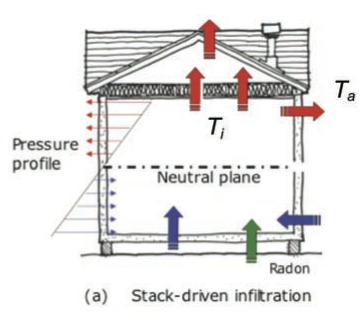
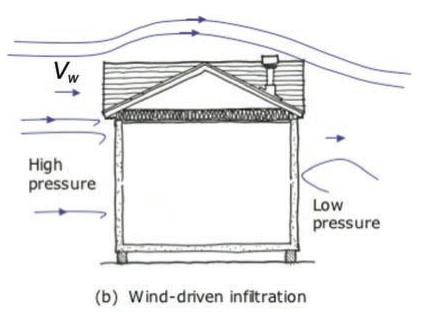
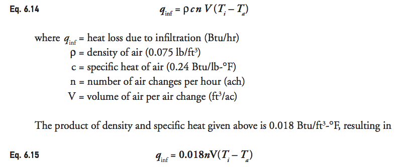
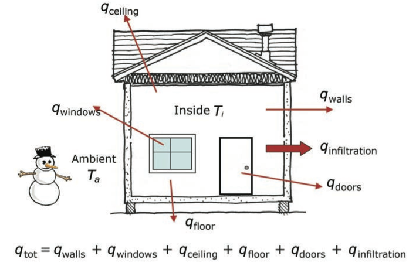
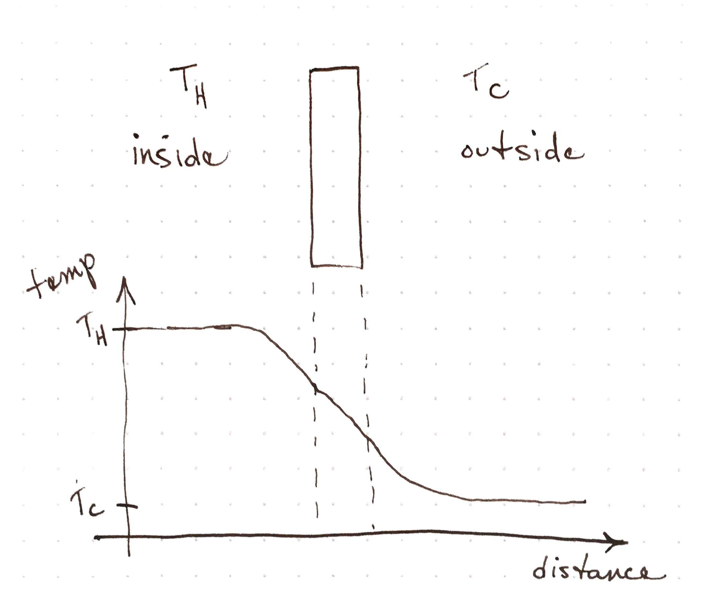
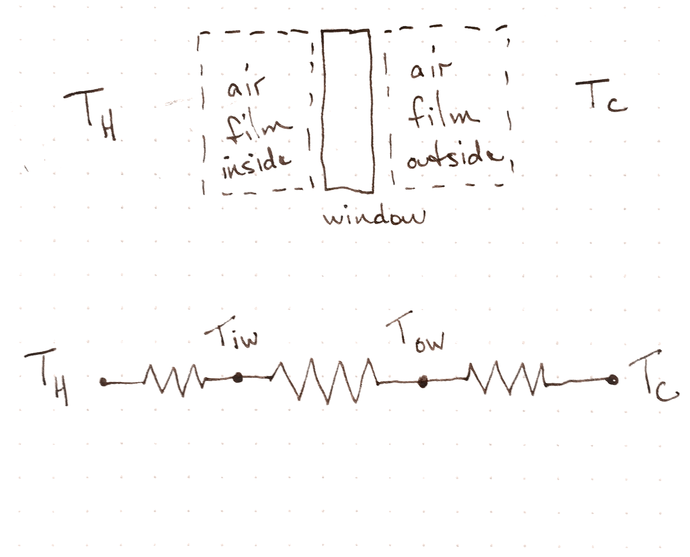
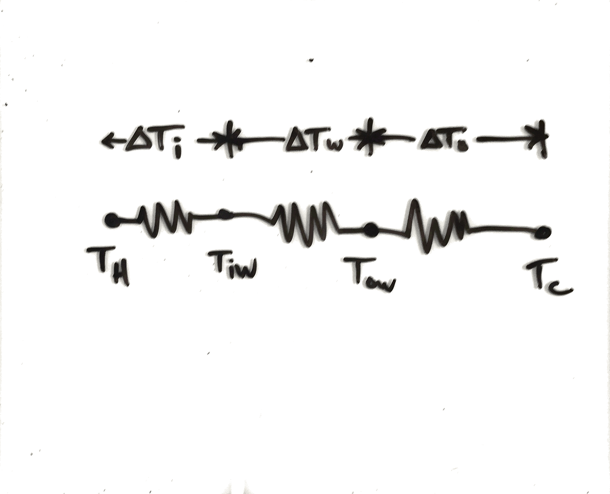

# Convection

## Learning Objectives
- Describe the mechanism of free convection
- Able to use buoyancy to describe stack effect and convection currents

## Thought experiments
- What are the air currents in a warm house on a cold day?
- What are the air currents near the window of a warm house on a cold
    day?

## Activity
- Draw a picture of air currents on both sides of a window with a
    temperature difference
- Draw the temperature profile as a function of distance

## Lumped R-values
- $$R_{cvi}$$ inside r value
- $$R_{cvo}$$ outside r value

<!-- did we underestimate R effect last time -->

## Stack Effect


## Wind Infiltration


## Heat capacity of infiltration

Infiltration has an impact on energy required to heat or cool a home.
The air brought in from the outside must be warmed or cooled to the same
temperature as the inside air.  This energy adds an extra burden on the
heating system.

We calculate this by the usual $$ Q = mc \Delta T $$ for a mass of air.
We can however, convert this to a constant power if we assume that we
have a constant rate of infiltration.  Imagine that we know the mass of
air that enters each hour.  Dividing both sides by time gives us a power
on one side and a mass rate for $$m$$.

$$ Q_{inf} = m_{inf} c_{air} \Delta T $$

$$ \frac{Q_{inf}}{\Delta t} =\frac{ m_{inf}}{\Delta t}c_{air} \Delta T $$

Now we have a rate of infiltration in mass per unit time and a power.

$$ q_{inf} = r_{inf} c_{air} \Delta T $$

In the industry, we express this as air changes per hour ($$n$$) which is
essentially a rate of mass of air per unit time once we multiply by the
volume of air in the building and the density of air.

$$ q_{inf} = \rho_{air} c_{air} n V \Delta T $$

Here the temperature difference is between the inside and outside air.



## Heat Loss



## Learning Objectives
- Perform convection calculations

## Temperature profile with air films


## Window Temperatures


## R-values

- $$R_{cvi}$$ = 0.68 hr-sqft-F/BTU
- $$R_{cvo}$$ = 0.17 hr-sqft-F/BTU
- 3/16 inch of glass, k = 5.5 BTU-in/hr-sqft-F

## Questions

- What is the inside temperature of the glass?
- What is the heat loss for a 2 foot by 3 foot window?


<!-- quiz went super long and we will do these calculations on monday -->
<!-- how will you figure this out in five years -->

## Method
- What is your overall strategy?
- How do you collect your starting values for your estimates?
- How will you organize your calculation so that you get it correct?
- How will you organize your calculation so that others understand it?

## Measurements
- Inside 70 degrees F
- Outside 25 degrees F
- 3/16 inch thick glass
- k = 5.5 BTU-in/hr-sqft-F

## Multiple Resistances



## Rate of increase

If we have a source of energy and assume that all that energy is going
into an object, we can calculate the rate of temperature rise of that
object.


$$ Q = mc\Delta T $$

We divide both sides by time.

$$ \frac{Q}{t} = \frac{mc\Delta T}{t} $$

Remember that Q is an energy.  That means Q over t is a power.

$$ P = \frac{mc\Delta T}{t} $$

If we rearrange this equation algebraically, we see that

$$ \frac{P}{mc} = \frac{\Delta T}{t} $$

This means that the power divided by the heat capacity gives you an
estimate of the rate of temperature increase in an object.

# Activity

## Tea Kettle
- Can we estimate the power of the tea kettle?

```
volume = 1 liter
mass_water = 1000 gram
time = 5 * 60 sec => 300 sec
heat_capacity = 4.186 joule/gram/kelvin
temperature_change = 75 kelvin

mass_water * heat_capacity
* temperature_change / time in watt => 1,046.5 watt
```

This is very close to our measure value of 1300 watts.


## Temperature Rise in the ETC

Can we estimate the increase in the air temperature during a large class
of students?

What assumptions do we need to make?

We can compare our estimation to the observed temperature rise on our
temperature sensor.

If these two temperature rates are very different, what plausible
reasons exist for the difference?
