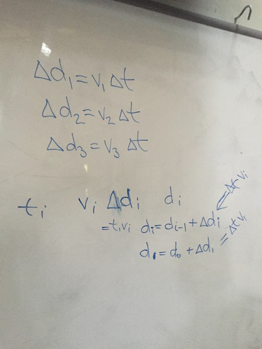
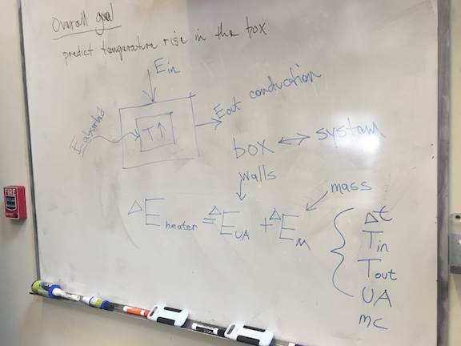
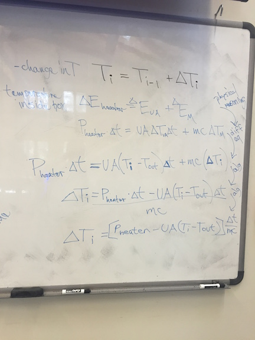
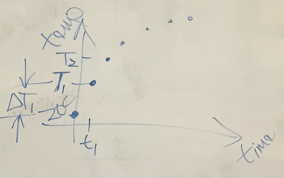

# Energy Modeling

## Modeling and Performance

- Code allows buildings to pass compliance for following a set of rules (prescriptive approach)
- Many predict an emphasis on building operation in the future
- This requires ways to observe and analyze data and make predctions

## Forward Models or Bottom-Up Models

- These models use measurements and properties of an object to make predictions about its behavior.
- Example: Estimate the UA product from the measurements and ideal thermal conductivities

## Backwards Models or Top-Down Models

- These models infer the properties of an object from observations of the objects behavior.
- Example: Estimate the UA product from the equilibrium temperature and the power input

## Intrusive and Non-Intrusive Data Collection

- Intrusive data collection requires changing the operating condition of the building, often in ways noticeable to the occupants.
- Non-intrusive data collection does not change the operation of a building.

## Slopes and Areas

- The key observables in thermal systems are temperature, power, and time.
- When graphed, the slopes and areas of these variables can provide important insight into building operation.

## Analytical Models

- For simple situations, we can write models using mathematical functions like the exponential function that describe building behavior.

## Computational Models

- For many physical situations, we start with a relationship for the slope of a curve and then use computational techniques to predict behavior.

## Data Collection Devices

- NetAtmo
- Digit

## Box Model

- Simple cardboard box with heater
- What do we expect the temperature rise to be?
- Draw a graph in your notes with your basic prediction
- We will take data and compare to our predictions

## Tree Discussion

- How do we decompose complex problems?
- Tree technique following Mahajan

## Review

- What did we do last time?
- Calculated the heat loss coefficient of our box by two methods
- Method one: observation of equilibrium temperature
- Method two: estimation from measurements and ideal R-values

## Warm-Up

- You are in a car with a watch and a clear view of the spedometer but
    the odometer is broken
- How do you estimate how far you have traveled?

## Draw a diagram

- How would you think about this graphically
- Graph total milage vs time
- Graph speed vs time

## Energy Balance

- First Law of Thermodynamics must be obeyed
- Where is the thermal energy in our system?

## Diagram

- Where are the thermal energy inputs and outputs in our system?

## Mathematical model

- Start by setting the energies equal to each other

$$ E_{in} = E_{out} $$

- Then add heat loss equation and thermal mass equation
- Can you solve to find the temperature?

## Written notes

There are many notes from the board today necessary to understand the
lecture.

