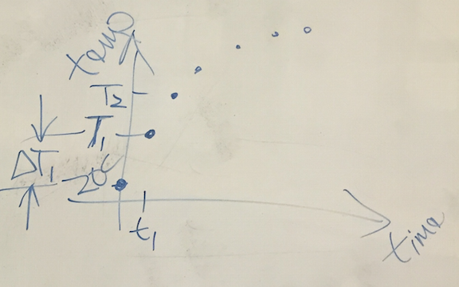

# Heated Enclosure

In this section, we demonstrate an analytical model and discrete model for a heated enclosure.

# Discrete Model

Our goal is to get an equation relating the change in temperature over time to the existing temperature and the power supplied to the box.
We start using an energy balance technique where we set the energy entering the system from a heater to the sum of the stored temperature energy and the energy conducting to the outside.
Since energy must be conserved, we can track the thermal energy.

We call our small amount of time $$\Delta t$$ and the small increase in the temperature of the box $$\Delta T$$.

$$ E_{in} = E_{out} $$

The power $$P$$ multiplied by $$\Delta t$$ is the energy entering the system.
$$mc \Delta T$$ is the energy associated with the change in temperature during this time.
$$mc$$ can include the wall material and the air or any material inside the enclosure and we assume that everything is at the same temperature.
$$UA (T - T_{out})$$ is the power conducting through the enclosure.
Multiplying this by $$\Delta T$$ gives us the energy leaving the system.

$$ P \Delta t = mc \Delta T + UA (T-T_{out}) \Delta t $$

We do some algebra to group the $\Delta t$ and $\Delta T$.

$$ (P - UA(T + T_{out})) \Delta t = mc \Delta T $$

We cross-multiply to create an expression for the change in temperature over the change in time.

$$ \frac{\Delta T}{\Delta t} = \frac{P - UA(T + T_{out})}{mc} $$

For a small amount of time ($$\Delta t$$), this equation predicts the change in temperature of the system.
Note that when the power entering equals the energy flowing out, the top of the fraction is zero and the temperature doesn't change.
This matches our idea of steady state.

# Discrete Solution

If we know the initial temperature, the power, and the $$UA$$ and the $$mc$$ values, we can use a computer to repeatedly calculate the temperature a short moment later and predict the behavior of the enclosure over time.

## Discrete solution warmup exercise

- You are in a car with a watch and a clear view of the spedometer but the odometer is broken
- How do you estimate how far you have traveled?

- How would you think about this graphically
- Graph total milage vs time
- Graph speed vs time

<!--  -->

<!--  -->

<!-- ## Discrete solution for heater enclosure -->

<!--  -->

<!--  -->

# Analytical Model

If the power and the properties of the box are constant, we can use calculus to get an analytical expression for the temperature over time.

$$ \frac{dt}{mc} = \frac{dT}{(P - UA(T + T_{out}))} $$

We integrate both sides

$$ \int_0^t\frac{dt}{mc} = \int_{T_0}^{T}\frac{dT}{(P - UA(T + T_{out}))} $$

To isolate the variable T, we multiply both sides by -UA.

$$ -\frac{UA}{mc}t = \ln(-P/UA + T - T_{out})) \|_{T_i}^{T}$$

$$  -\frac{UA}{mc}t = \ln\frac{T - P/UA - T_{out}}{T_i - P/UA - T_{out}} $$

We assume the initial temperature is the outside temperature

$$  -\frac{UA}{mc}t = \ln\frac{T - P/UA - T_{out}}{-P/UA} $$

We exponentiate both sides

$$  e^{-\frac{UA}{mc}t} = \frac{T - P/UA - T_{out}}{-P/UA} $$
$$  -\frac{P}{UA} e^{-\frac{UA}{mc}t} = T - \frac{P}{UA} - T_{out} $$

Rearranging we obtain

$$T = T_{out} + \frac{P}{UA}(1 - e^{-\frac{UA}{mc}t})$$

This equation starts at the outside temperature and approaches the outside temperature plus the temperature given by the ratio of the power and the $$UA$$ value.
The time constant in the exponential tells us how fast the temperature approaches the steady state value.