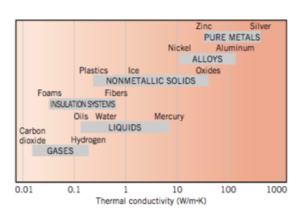
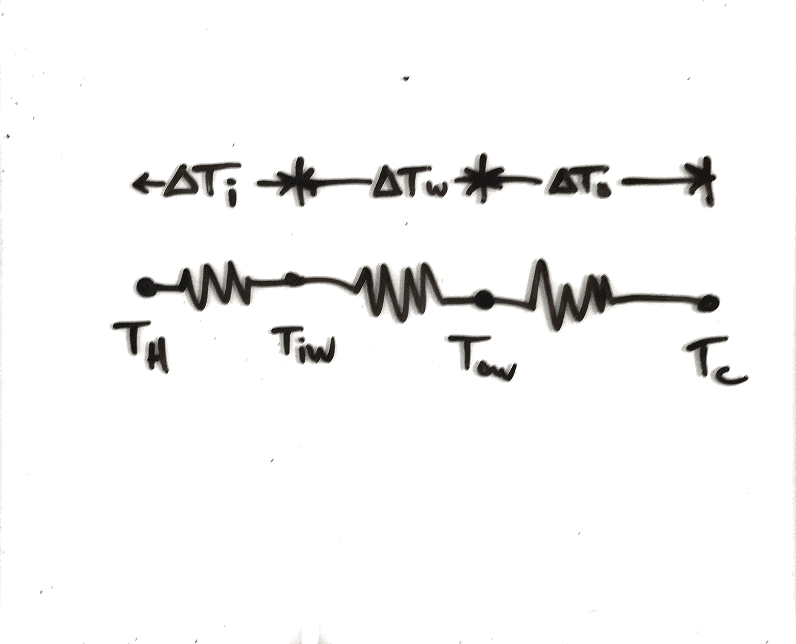
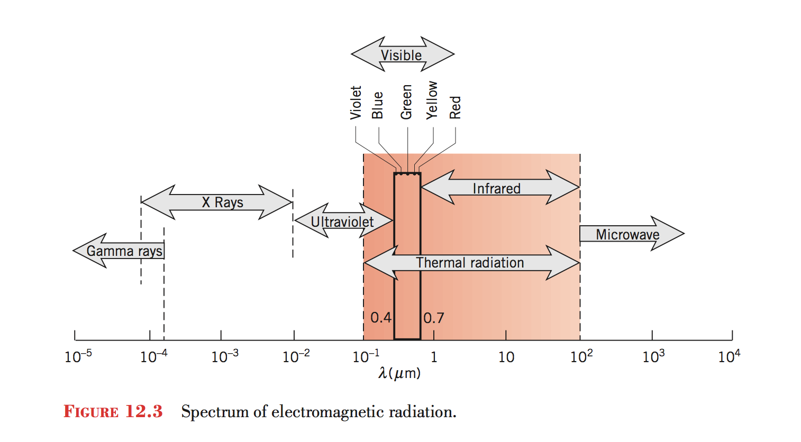
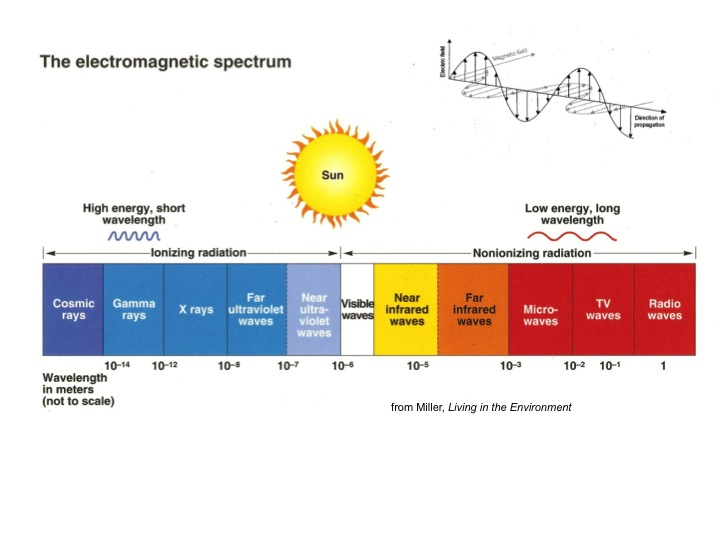
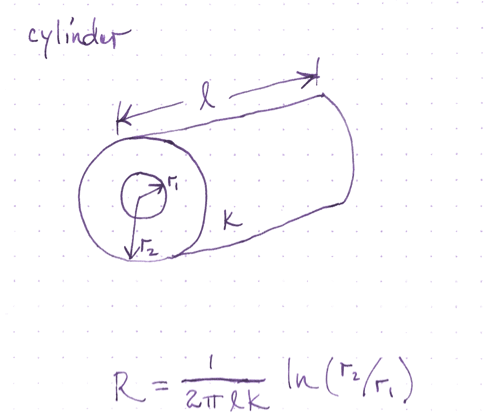

# Physics Fundamentals

# Questions

# Reading
- Hewitt, Conceptual Physics 13-16
- Incropera?
- EFS

# Basic Concepts

## Energy Units
- Joule
    - SI Unit.  One Newton-Meter.
- Kilowatt-Hour
    - Energy consumed by 1 kW load over one hour
- Calorie
    - Energy to heat one gram of water one degree Celsius
- Kilo-calorie
    - One thousand calories.  Used in food energy content.
- British Thermal Unit (BTU)
    - Energy to heat one pound of water by one degree Fahrenheit
- Quad
    - One quadrillion ($10^{15}$) BTU
- Therm

## Energy Unit Table

| Unit          |             | Joule Equivalent |
| ----          | -----       | -----            |
| Joule         |             |                  |
| Kilowatt-Hour |             | 3.6 MJ           |
| BTU           |             | 1055 J           |
| Calorie       |             | 4.186 J          |
| Food Calorie  |             | 4186 J           |
| Therm         | 100,000 BTU |                  |

## Power Units

- Watt
- Horsepower
- BTU/hour (sometimes just called BTU)

## Power Unit Table

| Unit       |       | Watt Equivalent |
| ----       | ----- | -----           |
| Watt       |       |                 |
| BTU/hour   |       | 0.293 Watt      |
| Horsepower |       | 750 Watt        |

# Temperature
- Internal energy
- Conversion between scales

# Heat
- energy flow from one point to another
- units and notation
- newtons law of cooling

# Heat Capacity
- specific heat
- specific heat capacity
- drop a hot metal in water

# Conduction

## Concepts

- R-value
- U-value
- Fourier's Law

## Thought experiment

Given a block of material sitting between two temperatures, what heat
flow do you expect?

## Fourier's Law

$$ q_x = -kA\frac{\Delta T}{\Delta x} $$

- $$q_x$$ dimensions of energy per time or power
- $A$ dimensions of area
- $k$ dimensions of power per distance per degree
- $\Delta T$ is the temperature difference
- $\Delta x$ is the thickness of the material

## Fourier's Law Differential Form

$$ q_x = -k \frac{dT}{dx} $$

$$ q = -k \nabla T $$

- $q_x$ dimensions of power per unit area
- $k$ dimensions of power per distance per degree

## Fourier's Law, Buildings Form

$$ Q = U A \Delta T $$

- $Q$ heat transfer dimensions of power
- $U$ dimensions of power per area per degree temperature
- $A$ dimension of area
- $T$ dimension of temperature

## Conductivity

## R value and U value

- Building materials publish an R-value
- Sometimes published as a U-value

## Conduction

## Conduction

## Conduction

## Units

- in US units R value is $ft^2 \circ F / BTU per hour$
- in SI units R value is $m^2 K / watt $

## Parallel

- If you have two conducting surfaces in parallel, the U-values add
- In parallel, the heat can take either path

## Series

- If you have two conducting surfaces in series, the U-values add
    according to
$$ U_{total} = \left(\frac{1}{U_1} + \frac{1}{U_2}\right)^{-1} $$
- In series, the heat must take both paths

## Learning Objectives

- Make calculations of R values

## Activity R-Value of SIP

- Are the components of the SIP in parallel or series?
- How do we find the properties of each?

## Typical R and U values

- Window range (US R-values)
    - R-1 for single pane
    - R-12.5 for more advanced windows
- Wall range
    - R-3.4 (2x4 no inssulation)
    - R-12.7 (2x4 R-13 insulation)
    - R-34.6 (2x6 R-21 insulation)

## Estimate Wall Loss in ETC

- What is the R-value?
- What is the total area of walls?

## Wall Example

- Wood 0.15 watts per kelvin per meter
- Polyurethane foam 0.02 watts per kelvin per meter
- [Conductivities](https://en.wikipedia.org/wiki/List_of_thermal_conductivities)
- 4.5 inch panel 13.8 R value

## Calca

    k_wood = 0.15 W/K/m
    k_foam = 0.02 W/K/m
    t_wood = 0.01 m
    t_foam = 0.08 m

    r_wood = t_wood/k_wood => 0.0667 m^2*K/W
    r_foam = t_foam/k_foam => 4 m^2*K/W

    r_SIP_SI = 2 * r_wood + r_foam => 4.1333 m^2*K/W

    r_SIP_US = r_SIP_SI * 5.68 ft^2/m^2*F/K*W/BTU => 23.4773 ft^2*F/BTU

## Bathtub model of heat flow

- What is the input?
- Now the drain is faster with greater temperature

# Convection

## Learning Objectives
- Describe the mechanism of free convection
- Able to use buoyancy to describe stack effect and convection currents

## Thought experiments
- What are the air currents in a warm house on a cold day?
- What are the air currents near the window of a warm house on a cold
    day?

## Activity
- Draw a picture of air currents on both sides of a window with a
    temperature difference
- Draw the temperature profile as a function of distance

## Lumped R-values
- $R_{cvi}$ inside r value
- $R_{cvo}$ outside r value

<!-- did we underestimate R effect last time -->

## Stack Effect

## Wind Infiltration

## Heat capacity of infiltration

## Heat Loss

## Learning Objectives
- Perform convection calculations

## Temperature profile with air films

## Window Temperatures

## R-values

- $R_{cvi}$ = 0.68 hr-sqft-F/BTU
- $R_{cvo}$ = 0.17 hr-sqft-F/BTU
- 3/16 inch of glass, k = 5.5 BTU-in/hr-sqft-F

## Questions

- What is the inside temperature of the glass?
- What is the heat loss for a 2 foot by 3 foot window?

<!-- quiz went super long and we will do these calculations on monday -->
<!-- how will you figure this out in five years -->

## Method
- What is your overall strategy?
- How do you collect your starting values for your estimates?
- How will you organize your calculation so that you get it correct?
- How will you organize your calculation so that others understand it?

## Measurements
- Inside 70 degrees F
- Outside 25 degrees F
- 3/16 inch thick glass
- k = 5.5 BTU-in/hr-sqft-F

## Multiple Resistances

# Radiation

## Radiation
- Why do you think radiant heat is important?
- Where do you observe radiant heat?
- What wavelengths are involved?

<!-- how much heat are we radiating? -->
<!-- how much heat do we receive from our environments? -->
<!-- what are the ways we experience this? -->
<!-- What percentage of home heat is lost to radiation? -->
<!-- why are clear nights colder -->
<!-- what is the background radiation temperature? -->

## Planck's law

- How do the wavelengths emitted changes as a substance increases in temperature?

## Planck's law

This law relates the intensity of power at each wavelength with the temperature
of an object (ideal black-body).

$$B_\lambda(\lambda, T) =\frac{2 hc^2}{\lambda^5}\frac{1}{ e^{\frac{hc}{\lambda k_\mathrm{B}T}} - 1} $$

## Stefan-Boltzmann law

- What predicts the total radiant power from a hot object?

## Stefan-Boltzmann law

This law relates the total power emitted to the temperature, surface area, and emissivity of an object.

$$ P = A \epsilon \sigma T^4 $$

|            |                           |                                                  |
| ---------- | ------------------------- | ------------------------------------------------ |
| $A$        | surface area              | square meters                                    |
| $\epsilon$ | emissivity                | dimensionless                                    |
| $\sigma$   | Stefan-Boltzmann constant | $5.67\cdot 10^{-8}$ W per square meter per K$^4$ |
| $T$        | temperature               | Kelvin                                           |

## Emissivity

The emissivity is how much radiant power is emitted by a substance relative to
an ideal black-body emitter.

## Emissive Power

<!-- how much power does a 40cm block of ice emit? -->

## Emissivities

## Spectrum

## Spectrum

## Net Radiative Heat Transfer
$$ P = \epsilon \sigma A (T_1^4 - T_2^4) $$

## Cylindrical Insulator

## Spherical Insulator

## Radiation transfer between surfaces
- Why is it colder on clear nights?

## Radiation transfer between surfaces

## Latent heat of fusion
- How much energy does it take to freeze a gram of water?
- What is the temperature of the water before and after freezing?

## Latent heat of vaporization
- How much energy does it take to boil a gram of water?
- What is the temperature of the water before and after boiling?

## Project Design Session
- What total rate of heat transfer do you need to last 24 hours?
- What does this mean for you design?
<!-- open ended design, much like, i want to be warm, build me a home -->

## Concepts
- Electromagnetic spectrum
- Emissivity
- Absorptivity
- Spectral response
- Planck Distribution
- Planck Law
- Net Radiative heat transfer

# Combustion

## Combustion
- Enthalpy
- High and low heating value
- Carbon Intensity
- Heaters and Stoves
- Cost per joule for gas, heating oil, electricity

## Conduction
- Heat transfer rates
- U value, R value
- Slab conduction
- Parallel values conduction
- Insulation, framing stuff
- Heat transfer by conduction

## Convection
- Heat capacity of air
- Infiltration
- Heat transfer by convection

## Radiation
- Blackbody
- Wein's law
- Emissivity
- Absorptivity
- Reflectivity
- Solar collectors
- Windows
- Heat transfer by radiation

## Phase changes
- latent heat storage
- wax insulation
- phase change
- evaporation
- condensation
- freezing
- melting
- ice storage

## Zeroth Law of Thermodynamics

## First Law of Thermodynamics
- furnaces

## Second Law of Thermodynamics
- Entropy
- heat pumps
- refrigerators

## Methane Combustion

- Methane + Oxygen -> Carbon Dioxide + Water + Energy
- CH~4~ + 2O~2~ -> CO~2~ + 2H~2~O

## Moles

- One mole is 6.02 $\times 10^{23}$ molecules (or atoms) of a substance

## Molar Weights

| Material | Mass of one Mole (grams) |
| -        | -                        |
| Carbon   | 12                       |
| Oxygen   | 16                       |
| Hydrogen | 1                        |

## Mole Conversion

- One mole of methane burned equals one mole of CO~2~ released
- Conversion factor:
$$\frac{\textrm{1 mole carbon dioxide
    released}}{\textrm{1 mole methane burned}}$$

## Mass Conversion

- We need to know the masses of these to make a conversion factor for
    mass of carbon dioxide released to mass of methane burned
- What is the mass of one mole of methane?
- 12 grams per oxygen atom + 4 mole hydrogen * 1 gram per hydrogen mole = 16 grams
- What is the mass of carbon dioxide?
- 12 + 2 * 16 = 44 grams per mole

## Mass Conversion

- 16g CH~4~ + 64g 2O~2~ -> 44g CO~2~ + 36g 2H~2~O

## Enthalpy of Formation

| Substance      | Enthalpy (kJ/mol) |
| -              | -                 |
| Oxygen gas     | 0                 |
| Liquid water   | -285.8            |
| Water Vapor    | -241.8            |
| Methane        | -74.9             |
| Carbon Dioxide | -393.5            |

## Energy Released

- Change in enthalpy is the sum of products minus the sum of reactants
- -393.5 + 2 * -241.8 - (-74.9 + 2 * 0) = -802.2 kJ/mol CH~4~ burned
- This yields 50.1 kJ per gram
- Compare to the published value

## Carbon Tax

- currently about 13 USD/tonne CO2 equivalent
- How much would this change the cost of one therm of natural gas?

## Caveat

- Some carbon dioxide emissions are listed as the mass of carbon
- Others are listed as the mass of carbon dioxide
- You can always convert between the two using the molecular weight
    ratio (44/12)

### Assumptions

- 100 cubic feet per therm
- 0.8 kg per cubic meter density of natural gas
- about $1 per therm

## Carbon Tax Calculation

    100 ft^3 * (1 m/3.3 ft)^3
             * 0.8 kg CH4/m^3
             * 44 kg CO2 / 16 kg CH4
             * 0.012 USD/kg CO2 => $0.0735

# Thermodynamics

## Concepts
- Temperature
- Fahrenheit, Celsius, Kelvin Scale
- Heat Capacity
- First Law of Thermodynamics
- Second Law of Thermodynamics
- Energy Efficiency

## Concepts
- Carnot cycle heat engine
- Carnot refrigerator
- Carnot efficiency
- Coefficient of performance for refrigeration
- Coefficient of performance for heating
- What is the carbon difference for heat pump vs combustion

## Temperature
- Measure of the internal energy in a system or material
- This energy is the motion, vibration, or rotation of atoms and
  molecules

## Heat Engine
- Heat engines convert thermal energy to mechanical kinetic energy
- This conversion can never be 100 percent efficient

## Heat Engine
- Coal power plant turbines
- Internal combustion engines

## Heat Engines
- The heat engine is a mathematical model
- Takes the heat (flow) between two thermal reservoirs and converts some of
  that heat to work
- Heat can come from combustion or natural sources of heat

## Heat Engines
- A heat engine is more efficient when it uses a wider temperature range
    between the hot and cold sides

## Second Law of Thermodynamics
- The amount of entropy (disorder) in a closed system always increases
- Heat flows spontaneously from hot to cold
- "You can't break even"

## Thermodynamic limit to heat engine
- Carnot derived the upper limit of efficiency for a heat engine
$$\eta = 1 - \frac{T_C}{T_H}$$
- This law dictates the maximum possible efficiency for power plants
- Some of the heat must be released into the environment

<!--
what happens when T_C goes to zero?
what happens when T_C and T_H are close to each other?
-->

## Heat Engine

## Quality

## Quality

## Carnot Heat Engine
- The most efficient heat engine possible uses a Carnot cycle
- Heat is used to expand a gas and do work and heat is removed during
  the compression of the gas.

## Power plant

## Power plant

## Zeroth Law of Thermodynamics
- If two systems are each in thermal equilibrium with a third system,
  they are also in thermal equilibrium with each other.
- Real world example: Coffee gets cold, ice cream melts

## First Law of Thermodynamics
- Energy is conserved
- Energy cannot be created or destroyed
- "You can't get something for nothing"

## First Law Efficiency
- Most commonly used measure of efficiency
- Useful energy out divided by total energy in

## Coefficient of Performance

## Maximum COP

For refrigeration
$$ COP_R = \frac{T_C}{T_H - T_C} $$

For a heat pump
$$ COP_{HP} = \frac{T_H}{T_H - T_C} $$

## Activity

- Show that one kilowatt-hour is equal to 3.6 MJ.

