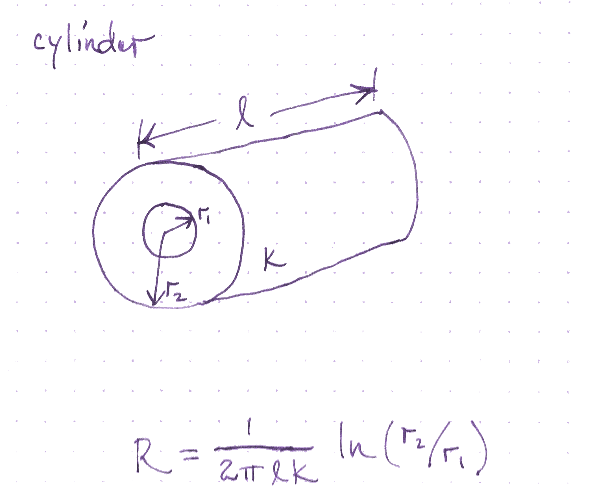
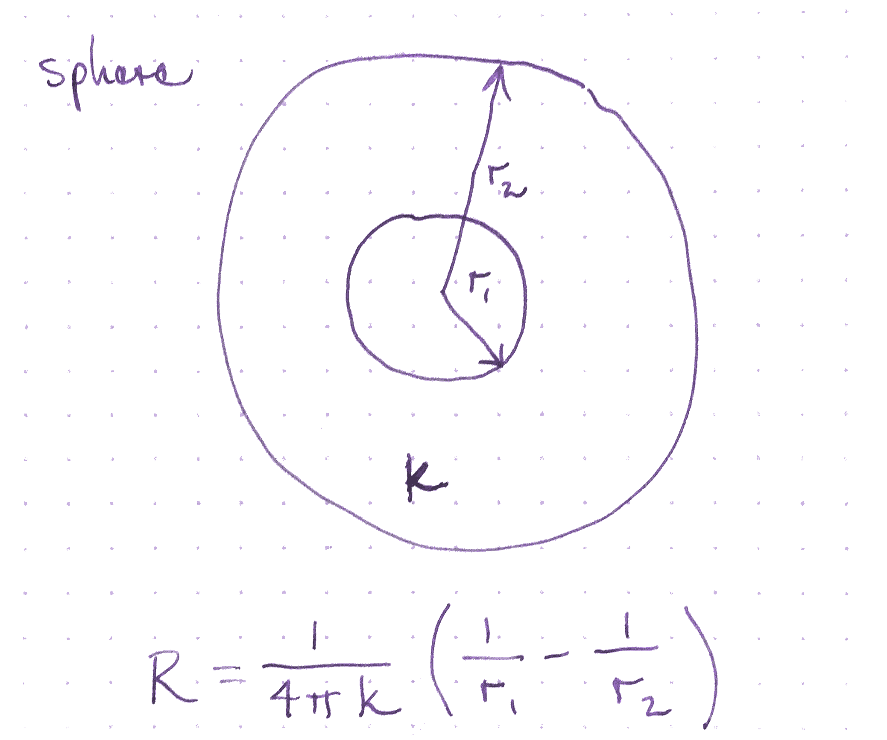

# Radiation

## Radiation
- Why do you think radiant heat is important?
- Where do you observe radiant heat?
- What wavelengths are involved?

<!-- how much heat are we radiating? -->
<!-- how much heat do we receive from our environments? -->
<!-- what are the ways we experience this? -->
<!-- What percentage of home heat is lost to radiation? -->
<!-- why are clear nights colder -->
<!-- what is the background radiation temperature? -->

## Planck's law

- How do the wavelengths emitted changes as a substance increases in temperature?

## Planck's law

This law relates the intensity of power at each wavelength with the temperature
of an object (ideal black-body).

$$B_\lambda(\lambda, T) =\frac{2 hc^2}{\lambda^5}\frac{1}{ e^{\frac{hc}{\lambda k_\mathrm{B}T}} - 1} $$

## Stefan-Boltzmann law

- What predicts the total radiant power from a hot object?

## Stefan-Boltzmann law

This law relates the total power emitted to the temperature, surface area, and emissivity of an object.

$$ P = A \epsilon \sigma T^4 $$

|            |                           |                                                  |
| ---------- | ------------------------- | ------------------------------------------------ |
| $$A$$        | surface area              | square meters                                    |
| $$\epsilon$$ | emissivity                | dimensionless                                    |
| $$\sigma$$   | Stefan-Boltzmann constant | $$5.67\cdot 10^{-8}$$ W per square meter per K$$^4$$ |
| $$T$$        | temperature               | Kelvin                                           |

## Emissivity

The emissivity is how much radiant power is emitted by a substance relative to
an ideal black-body emitter.

## Emissive Power

<!-- how much power does a 40cm block of ice emit? -->

## Emissivities

## Spectrum

## Spectrum

## Net Radiative Heat Transfer
$$ P = \epsilon \sigma A (T_1^4 - T_2^4) $$

## Cylindrical Insulator

## Spherical Insulator

## Radiation transfer between surfaces
- Why is it colder on clear nights?

## Radiation transfer between surfaces

## Latent heat of fusion
- How much energy does it take to freeze a gram of water?
- What is the temperature of the water before and after freezing?

## Latent heat of vaporization
- How much energy does it take to boil a gram of water?
- What is the temperature of the water before and after boiling?

## Project Design Session
- What total rate of heat transfer do you need to last 24 hours?
- What does this mean for you design?
<!-- open ended design, much like, i want to be warm, build me a home -->

## Concepts
- Electromagnetic spectrum
- Emissivity
- Absorptivity
- Spectral response
- Planck Distribution
- Planck Law
- Net Radiative heat transfer

