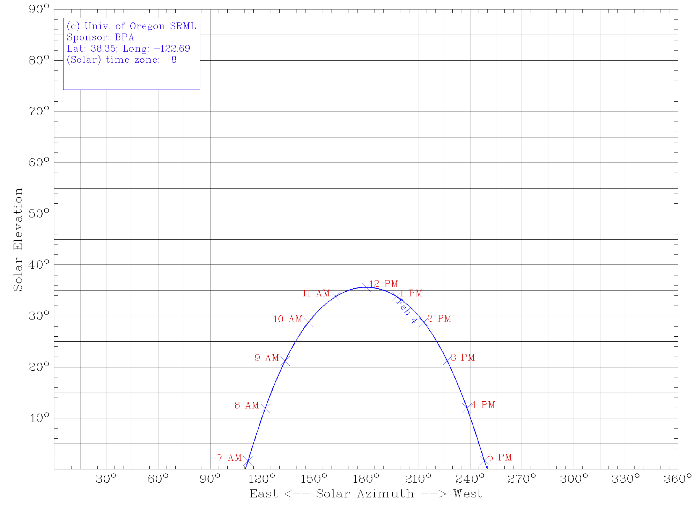
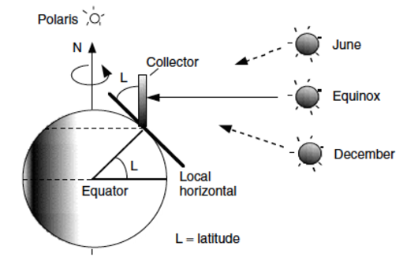
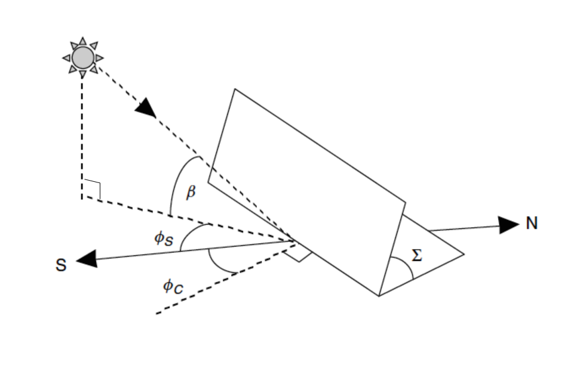

# Solar Fundamentals

# Questions

- What causes the seasons?
- What time of day is the sun highest in the sky?
- What time of year is the sun highest in the sky?
- Where does the sun rise?
- Where does the sun set?
- When are shadows the longest?

# Concepts

- Solar Constant
- Solar Elevation
- Solar Azimuth
- Solar Declination

## Solar Constant

The radiation reaching the outer atmosphere.
About 1388 watts per square meter.

## Solar Elevation

The vertical angle of the sun.
Zero degrees at sunset or sunrise.
90 degrees if directly overhead.

## Solar Azimuth

The "compass angle" of the sun.
Due south at noon (in the northern hemisphere).
To the west at sunset.
To the east at sunrise.

## Solar Declination

The angle of the earths equatorial plane and the plane of the earths orbit.
Varies between -23.5 and 23.5 degrees and causes the seasons.

# Descriptions

## Seasons
- What causes the seasons?
- The Earth's axis of rotation is tilted with respect to the orbital or
  ecliptic plane
- This changes the intensity of sunlight in different parts of the globe
- It also changes the distance the rays travel through the atmosphere

## Earth orientation and orbit

## Sun Ray Angles

## Sun Ray Angles

## Solar declination
- Measures the elevation of the sun relative to the earth's equitorial
  plane
- From the earth's perspective, the sun exhibits a sinusoidal up and
  down motion with a period of one year.

## Solar declination

## Declination equation
We can estimate the declination of the sun with this equation

$$23.5 \sin\left(\frac{2\pi(n-81)}{365}\right)$$

- n is the day of the year

## Declination plot
- [Solar Declination](http://nbviewer.ipython.org/github/dsoto/PyPVSim/blob/master/ipynb/solar_declination.ipynb)

## Solar position
- How many angles do we need to specify the sun's position in the sky?
- Elevation
- Azimuth

## Hour angle
- Angle of earth rotation with respect to solar noon

## Elevation
We measure the vertical angle from the plane of the ground to the sun

$$\sin\beta = \cos L \cos \delta \cos H + \sin L \sin \delta $$

- $$L$$ is the latitude angle
- $$\delta$$ is the declination angle
- $$H$$ is the hour angle

## Azimuth
We measure the horizontal angle of the sun from north

$$\sin \phi = \cos \delta \sin H / \cos \beta$$

- $$L$$ is the latitude angle
- $$\delta$$ is the declination angle
- $$H$$ is the hour angle

# Practical Elements

## Sun path diagrams
- Do we have to calculate these cumbersome formulas anytime we want to find the sun?
- [Oregon Sun Path](http://solardat.uoregon.edu/SunChartProgram.html)
- http://solardat.uoregon.edu/SunChartProgram.html

## Sun path for February 4

## Sun path for SSU

## Python Sun Path
- [Sun path](http://nbviewer.ipython.org/github/dsoto/PyPVSim/blob/master/ipynb/sunpath.ipynb)

## Hour angle
$$ H = \frac{15 degrees}{hour} \cdot \textrm{hours before solar noon} $$

## Common panel tilt

Panels tilted at the latitude so equinox sun strikes directly.

<!-- ideas why we do this? -->

## Solar angle calculation

Starting with the day, location, and time, calculate the sun position

(See written notes)

## Solar angle measurement

If weather permits, we'll verify this calculation with a direct
measurement.

## Solar Angles

- Elevation
- Azimuth
- Relation to architectural features

## How much solar energy strikes a collector?
- Collector can be any flat plate
- Calculate extraterrestrial insolution
- Calculate atmospheric air mass
- Calculate attenuation by air mass
- Adjust for angle between direct rays and collector

## Normal angle
- The normal is a vector perpendicular to a plane
- The angle between this normal and the sun's rays determines the
  collected radiation
<!-- You may recognize this as the dot product -->

## Angle of the sun and panel
- $$I_{BC} = I_B \cos \theta$$
- $$I_B$$ - insolation at earth's surface (W/m$$^2$$)
- $$I_{BC}$$ - insolation on collector (W/m$$^2$$)
- $$\theta$$ - no units
- $$\cos \theta$$ - no units

## Angle between sun and panel
$$ \cos\theta = \cos\beta\cos(\phi_s - \phi_c)\sin\Sigma +
\sin\beta\cos\Sigma $$

- $$\theta$$ - angle between direct beam and panel normal
- $$\beta$$ - solar elevation
- $$\phi_s$$ - solar azimuth angle
- $$\phi_c$$ - panel azimuth angle
- $$\Sigma$$ - panel tilt

## Angle of the sun and panel
- $$I_{BC} = I_B \cos \theta$$

## Angle of the sun and panel
We can determine the angle of the sunlight and the panel from the sun's
elevation and azimuth, and the tilt and angle of the panel.

