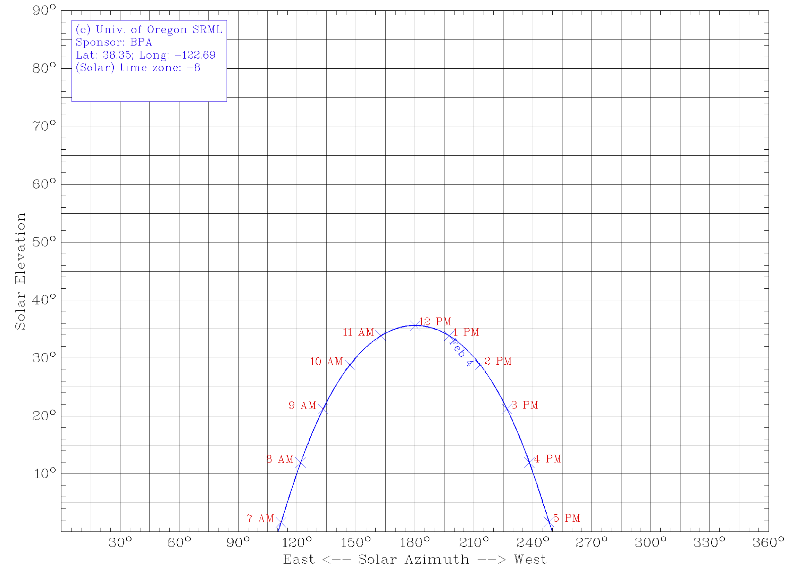
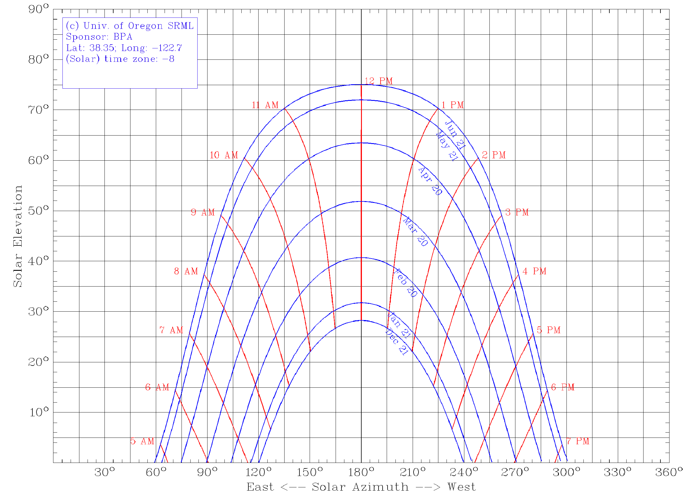

# Solar Energy

This section covers the fundamentals of solar energy.  From this we can
determine how much energy is available over an area to be used for heat
or electricity.

# Solar Angles

- Elevation
- Azimuth
- Relation to architectural features

# Solar Irradiation

- Solar Constant
- Peak sun hours

# Radiation Basics

- Power per unit area
- Spectral intensity

<!-- pull notes from ENSP 438 -->

# Mass Glazing Ratio

# References

- Renewable and Efficient, Gil Masters

## Questions we will be able to answer
- Where is the sun at any time?
- How much radiation does it produce?
- Where do I put solar panels?
- Will my solar panels be blocked by trees or homes?
- Which direction should they face?
- How much will they produce now? this month?  this year?

## Questions for class
- What causes the seasons?
- What time of day is the sun highest in the sky?
- What time of year is the sun highest in the sky?
- Where does the sun rise?
- Where does the sun set?
- When are shadows the longest?

<!-- what does the class know from common experience? -->

## The journey of a photon
- Created in the core of the sun
- Millions of years to bounce out to surface of sun
- Zips to earth in about 8 minutes
- Passes through the atmosphere
- Strikes a solar panel and dislodges an electron in the PV panel
- Electron is collected and delivered to the grid

## Electromagnetic Spectrum

## Blackbody Spectrum

## Solar Spectrum

## The Solar System

## Seasons
- What causes the seasons?

## Seasons
- The Earth's axis of rotation is tilted with respect to the orbital or
  ecliptic plane
- This changes the intensity of sunlight in different parts of the globe
- It also changes the distance the rays travel through the atmosphere

## Earth orientation and orbit

## Sun Ray Angles

## Sun Ray Angles

## Radiation units
- Power per unit area (watts per square meter) (W/m$$^2$$)
- Power = Power per unit area $$\times$$ area
- Energy = Power $$\times$$ Time

## Atmospheric depth

## Atmospheric absorption
- Air mass ratio
- $$I_B = Ae^{-km}$$
- $$I_B$$ - insolation at earth's surface (W/m$$^2$$)
- $$A$$ - insolation in space (W/m$$^2$$)
- $$k$$ - optical depth (no units)
- $$m$$ - air mass ratio (no units)

<!-- TODO: what are typical optical depths? -->

## Air mass ratio

## Air mass ratio
- There are some standard air mass ratios we use
- AM0 is "in space"
- AM1 is for noon-day sun
- AM1.5 is the standard test condition that resembles year round
  insolation

## Earth sun distance
$$ d=1.5 \times 10^8
\left(1 + 0.017 sin\left(\frac{360(n-93)}{365}\right)\right)km $$

- $$n$$ is the day of the year
- Is this close to circular?

<!-- homework advanced.  the sun is an inverse square source of energy. -->
<!-- what is the difference in energy from max to min? -->

## Solar declination
- Measures the elevation of the sun relative to the earth's equitorial
  plane
- From the earth's perspective, the sun exhibits a sinusoidal up and
  down motion with a period of one year.

## Solar declination

## Declination equation
We can estimate the declination of the sun with this equation

$$23.5 \sin\left(\frac{2\pi(n-81)}{365}\right)$$

- n is the day of the year

## Declination plot
- [Solar Declination](http://nbviewer.ipython.org/github/dsoto/PyPVSim/blob/master/ipynb/solar_declination.ipynb)

## Solar position
- How many angles do we need to specify the sun's position in the sky?
- Elevation
- Azimuth

## Hour angle
- Angle of earth rotation with respect to solar noon

## Elevation
We measure the vertical angle from the plane of the ground to the sun

$$\sin\beta = \cos L \cos \delta \cos H + \sin L \sin \delta $$

- $$L$$ is the latitude angle
- $$\delta$$ is the declination angle
- $$H$$ is the hour angle

## Azimuth
We measure the horizontal angle of the sun from north

$$\sin \phi = \cos \delta \sin H / \cos \beta$$

- $$L$$ is the latitude angle
- $$\delta$$ is the declination angle
- $$H$$ is the hour angle

## Sun path diagrams
- Do we have to calculate these cumbersome formulas anytime we want to find the sun?
- [Oregon Sun Path](http://solardat.uoregon.edu/SunChartProgram.html)
- http://solardat.uoregon.edu/SunChartProgram.html

## Sun path for February 4

## Sun path for SSU

## Python Sun Path
- [Sun path](http://nbviewer.ipython.org/github/dsoto/PyPVSim/blob/master/ipynb/sunpath.ipynb)

## Theory vs Practice
- I'll demonstrate mathematical expressions for solar radiation
- In practice you will use tables or software applications that
  calculate these values
- I want you to be able to go back in 10 years, pick up this book, and
  figure it out again.

## Summary of Angles
- Box 4.1 of REEPS

## Hour angle
$$ H = \frac{15 degrees}{hour} \cdot \textrm{hours before solar noon} $$

## Common panel tilt

Panels tilted at the latitude so equinox sun strikes directly.

<!-- ideas why we do this? -->

## Solar angle calculation

Starting with the day, location, and time, calculate the sun position

(See written notes)

## Solar angle measurement

If weather permits, we'll verify this calculation with a direct
measurement.

## How much solar energy strikes a collector?
- Collector can be any flat plate
- Calculate extraterrestrial insolution
- Calculate atmospheric air mass
- Calculate attenuation by air mass
- Adjust for angle between direct rays and collector

## Normal angle
- The normal is a vector perpendicular to a plane
- The angle between this normal and the sun's rays determines the
  collected radiation
<!-- You may recognize this as the dot product -->

## Angle of the sun and panel
- $$I_{BC} = I_B \cos \theta$$
- $$I_B$$ - insolation at earth's surface (W/m$$^2$$)
- $$I_{BC}$$ - insolation on collector (W/m$$^2$$)
- $$\theta$$ - no units
- $$\cos \theta$$ - no units

## Angle between sun and panel
$$ \cos\theta = \cos\beta\cos(\phi_s - \phi_c)\sin\Sigma +
\sin\beta\cos\Sigma $$

- $$\theta$$ - angle between direct beam and panel normal
- $$\beta$$ - solar elevation
- $$\phi_s$$ - solar azimuth angle
- $$\phi_c$$ - panel azimuth angle
- $$\Sigma$$ - panel tilt

## Angle of the sun and panel
- $$I_{BC} = I_B \cos \theta$$

## Angle of the sun and panel
We can determine the angle of the sunlight and the panel from the sun's
elevation and azimuth, and the tilt and angle of the panel.

## Extraterrestrial solar radiation
- Sunlight striking the top of the atmosphere

$$ I_0 = SC \left( 1 + 0.034 \cos\left(360n/365)\right)\right) $$

Where
- $$SC = 1367 W/m^2$$

## Solar Measurements
- Pyranometers

## Shading Measurements
- [Solmetric](http://www.solmetric.com)
- [Path finder](http://www.solarpathfinder.com/)

## Path Finder

##

<!-- how do we do this as cheaply as possible? -->
<!-- we want to maximize accuracy and guarantee power but minimize cost of doing it -->

<!-- Check and record ETC meters -->

## Historical radiation data

## Radiation measurements
- We've seen how to calculate radiation
- How do we measure it?

## Measuring solar radiation

## Typical meteorological year
- Hourly solar and weather estimates for typical conditions
- Based on historical data

## Typical meteorological year
[NREL TMY3](http://rredc.nrel.gov/solar/old_data/nsrdb/1991-2005/tmy3/)

## TMY Station Locations
[NREL Station Map](http://rredc.nrel.gov/solar/old_data/nsrdb/1991-2005/tmy3/usTMYmaps3medium.gif)

## TMY quantities
- Global Horizontal Irradiance (GHI)
- Direct Normal Irradiance (DNI)
- Diffuse Horizontal Irradiance (DHI)

## Components of solar radiation
- Direct
- Reflected
- Diffuse

## Direct, reflected, diffuse

