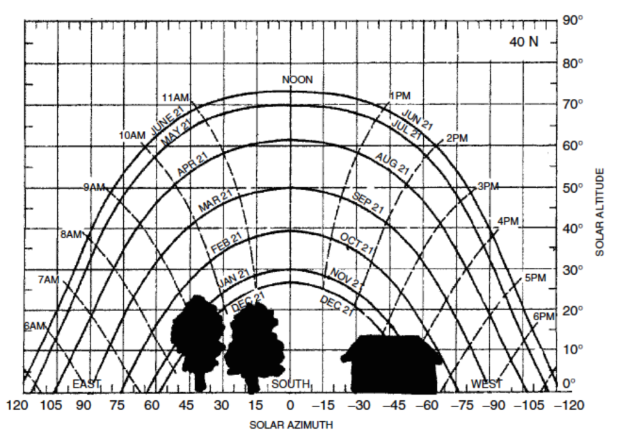

# Solar Energy

This section covers the fundamentals of solar energy.  From this we can
determine how much energy is available over an area to be used for heat
or electricity.

# Motivation

To use the sun effectively as a source of energy, we have to know how it
moves through the sky and what energy is available.  From this knowledge
we can place photovoltaic panels, building windows, or heat collectors
correctly.

## References

- Renewable and Efficient, Gil Masters

## Questions we will be able to answer
- Where is the sun at any time?
- How much radiation does it produce?
- Where do I put solar panels or windows?
- Will my solar devices be blocked by trees or homes?
- Which direction should they face?
- How much will they produce now? this month?  this year?

<!-- what does the class know from common experience? -->

# Solar Fundamentals

This section covers the sun, the solar system, and the atmosphere in
order to understand the radiation striking the earth.

## The journey of a photon
- Created in the core of the sun
- Millions of years to bounce out to surface of sun
- Zips to earth in about 8 minutes
- Passes through the atmosphere
- Strikes a solar panel and dislodges an electron in the PV panel
- Electron is collected and delivered to the grid

## Electromagnetic Spectrum

## Blackbody Spectrum

## Solar Spectrum

## The Solar System

## Radiation units
- Power per unit area (watts per square meter) (W/m$$^2$$)
- Power = Power per unit area $$\times$$ area
- Energy = Power $$\times$$ Time

## Atmospheric depth

## Atmospheric absorption
- Air mass ratio
- $$I_B = Ae^{-km}$$
- $$I_B$$ - insolation at earth's surface (W/m$$^2$$)
- $$A$$ - insolation in space (W/m$$^2$$)
- $$k$$ - optical depth (no units)
- $$m$$ - air mass ratio (no units)

<!-- TODO: what are typical optical depths? -->

## Air mass ratio

## Air mass ratio
- There are some standard air mass ratios we use
- AM0 is "in space"
- AM1 is for noon-day sun
- AM1.5 is the standard test condition that resembles year round
  insolation

## Earth sun distance
$$ d=1.5 \times 10^8
\left(1 + 0.017 sin\left(\frac{360(n-93)}{365}\right)\right)km $$

- $$n$$ is the day of the year
- Is this close to circular?

<!-- homework advanced.  the sun is an inverse square source of energy. -->
<!-- what is the difference in energy from max to min? -->

## Theory vs Practice
- I'll demonstrate mathematical expressions for solar radiation
- In practice you will use tables or software applications that
  calculate these values
- I want you to be able to go back in 10 years, pick up this book, and
  figure it out again.

## Summary of Angles
- Box 4.1 of REEPS

## Solar Irradiation

- Solar Constant
- Peak sun hours

## Radiation Basics

- Power per unit area
- Spectral intensity

<!-- pull notes from ENSP 438 -->

## Mass Glazing Ratio

## Extraterrestrial solar radiation
- Sunlight striking the top of the atmosphere

$$ I_0 = SC \left( 1 + 0.034 \cos\left(360n/365)\right)\right) $$

Where
- $$SC = 1367 W/m^2$$

## Software Implementation

You can see an example of these equations implemented in a software
library at these locations

- https://github.com/dsoto/PyPVSim/blob/master/pypvsim/pvsim.py
- https://github.com/pvlib/pvlib-python

## Solar Measurements
- Pyranometers

## Shading Measurements
- [Solmetric](http://www.solmetric.com)
- [Path finder](http://www.solarpathfinder.com/)

## Path Finder

##

<!-- how do we do this as cheaply as possible? -->
<!-- we want to maximize accuracy and guarantee power but minimize cost of doing it -->

<!-- Check and record ETC meters -->

## Historical radiation data

## Radiation measurements
- We've seen how to calculate radiation
- How do we measure it?

## Measuring solar radiation

## Typical meteorological year
- Hourly solar and weather estimates for typical conditions
- Based on historical data

## Typical meteorological year
[NREL TMY3](http://rredc.nrel.gov/solar/old_data/nsrdb/1991-2005/tmy3/)

## TMY Station Locations
[NREL Station Map](http://rredc.nrel.gov/solar/old_data/nsrdb/1991-2005/tmy3/usTMYmaps3medium.gif)

## TMY quantities
- Global Horizontal Irradiance (GHI)
- Direct Normal Irradiance (DNI)
- Diffuse Horizontal Irradiance (DHI)

## Components of solar radiation
- Direct
- Reflected
- Diffuse

## Direct, reflected, diffuse

