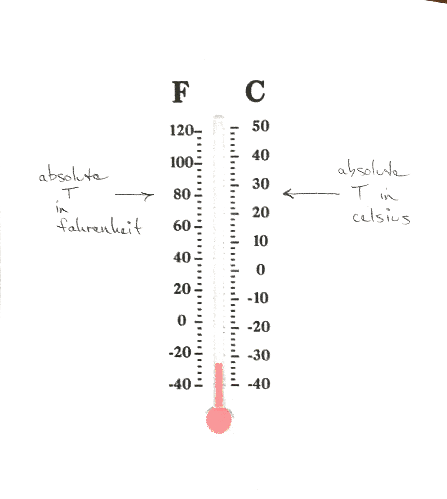
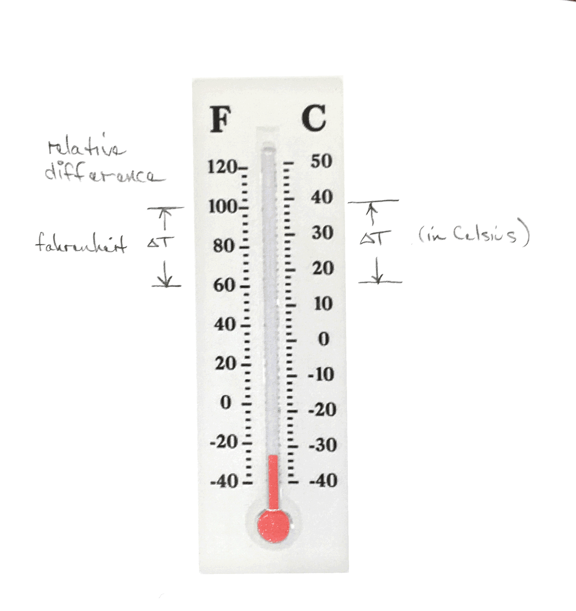

## Temperature
- Measure of the internal energy in a system or material
- This energy is the motion, vibration, or rotation of atoms and
  molecules

## Temperature Scales

## Converting Temperature

- Absolute temperature conversion
- Temperature difference conversion

$$ T_{F} = \frac{9}{5} T_{C} + 32 $$

$$ \Delta T_{F} = \frac{9 F}{5 C} \Delta T_{C} $$

Note that a degree C is a larger increment in temperature than a degree
Fahrenheit.  This makes it easier to deduce whether to multiply by 9/5
or by 5/9.

