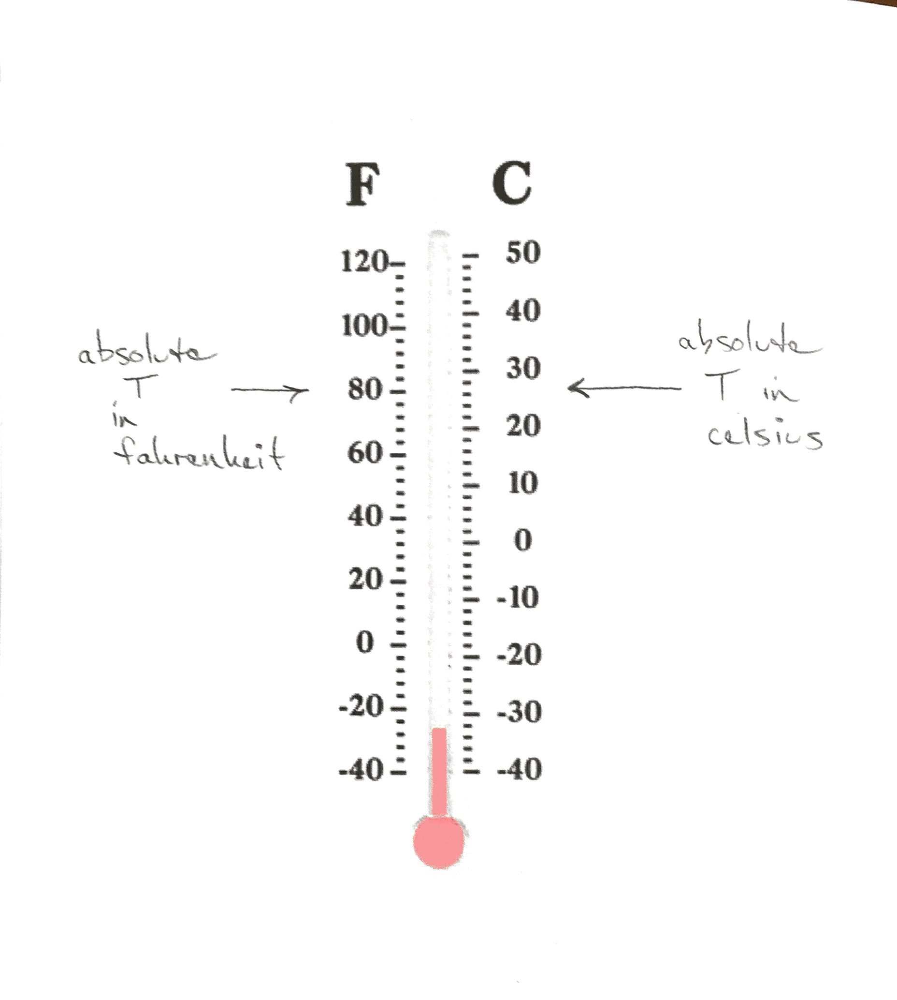
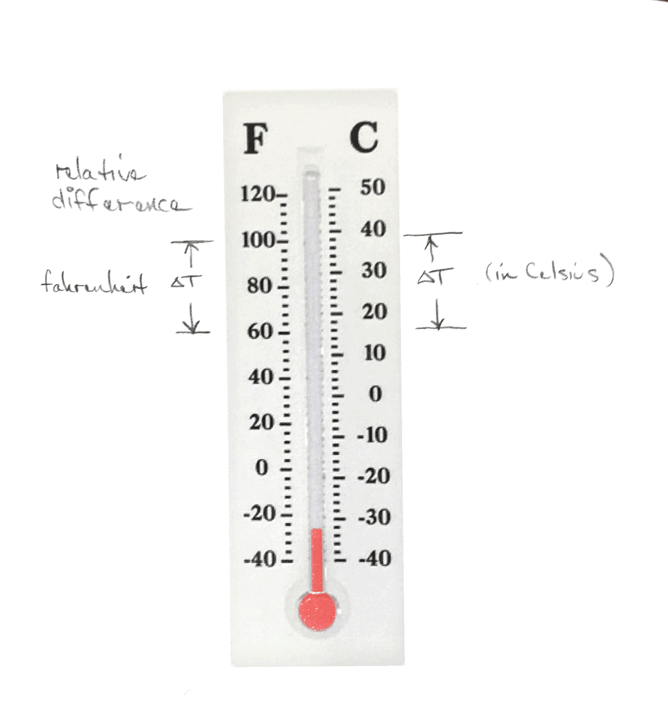

## Learning Objectives

- Understand and calculate heat capacity to find energy needed to raise
    temperatures of materials


## Temperature
- Measure of the internal energy in a system or material
- This energy is the motion, vibration, or rotation of atoms and
  molecules


## Temperature Scales


## Converting Temperature

- Absolute temperature conversion
- Temperature difference conversion

$$ T_{F} = \frac{9}{5} T_{C} + 32 $$

$$ \Delta T_{F} = \frac{9 F}{5 C} \Delta T_{C} $$

Note that a degree C is a larger increment in temperature than a degree
Fahrenheit.  This makes it easier to deduce whether to multiply by 9/5
or by 5/9.





## Heat Capacity

- When heat moves from one material to another one temperature rises the
    other falls
- The temperature rise occurs as heat increases the motion of atoms in
    the material
- The rate of change in temperature with added energy is dictated by the heat capacity
- Ratio of heat added to temperature change

## Intensive vs Extensive Properties

- Intensive or bulk property
    - Does not depend on the amount of material
    - Example: temperature, density
- Extensive property
    - Depends on the amount of material
    - Example: mass, volume


## Heat Capacity

- Extensive property
- Measured in Joules per degree Kelvin


## Specific Heat Capacity

- Intensive property
- Measured in Joules per mass per degree Kelvin


## Table of Specific Heat Values

| Material | Heat Capacity (Joule/gram/kelvin) |
| --       | --                                |
| Air      | 1                                 |
| Water    | 4.1813                            |
| Iron     | 0.45                              |
| Aluminum | 0.897                             |
| Brick    | 0.840                             |
| Wood     | 1.2 - 2.9                         |

Partial list from https://en.wikipedia.org/wiki/Heat_capacity


## Heat capacity

$$ Q = mc\Delta T $$

- $$Q$$ is energy transferred to or from substance
- $$m$$ is the mass
- $$c$$ is the specific heat capacity
- $$\Delta T$$ is the temperature change


## Relation to Buildings

- Thermal mass is added to a building to store heat


## Relation to Weather and Climate

- The heat capacity of water affects the climate in some areas

## Rate of increase

If we have a source of energy and assume that all that energy is going
into an object, we can calculate the rate of temperature rise of that
object.


$$ Q = mc\Delta T $$

We divide both sides by time.

$$ \frac{Q}{t} = \frac{mc\Delta T}{t} $$

Remember that Q is an energy.  That means Q over t is a power.

$$ P = \frac{mc\Delta T}{t} $$

If we rearrange this equation algebraically, we see that

$$ \frac{P}{mc} = \frac{\Delta T}{t} $$

This means that the power divided by the heat capacity gives you an
estimate of the rate of temperature increase in an object.

# Activity

## Tea Kettle
- Can we estimate the power of the tea kettle?

```
volume = 1 liter
mass_water = 1000 gram
time = 5 * 60 sec => 300 sec
heat_capacity = 4.186 joule/gram/kelvin
temperature_change = 75 kelvin

mass_water * heat_capacity
* temperature_change / time in watt => 1,046.5 watt
```

This is very close to our measure value of 1300 watts.


## Temperature Rise in the ETC

Can we estimate the increase in the air temperature during a large class
of students?

What assumptions do we need to make?

We can compare our estimation to the observed temperature rise on our
temperature sensor.

If these two temperature rates are very different, what plausible
reasons exist for the difference?
