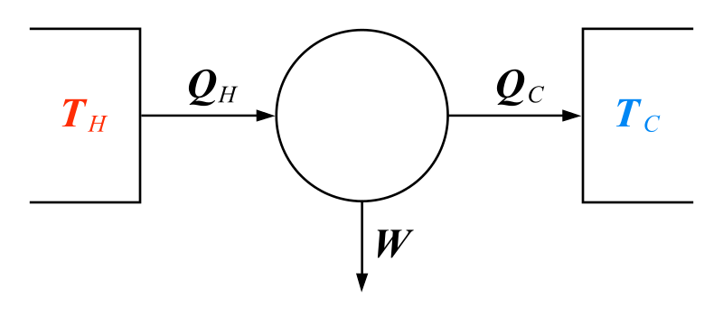
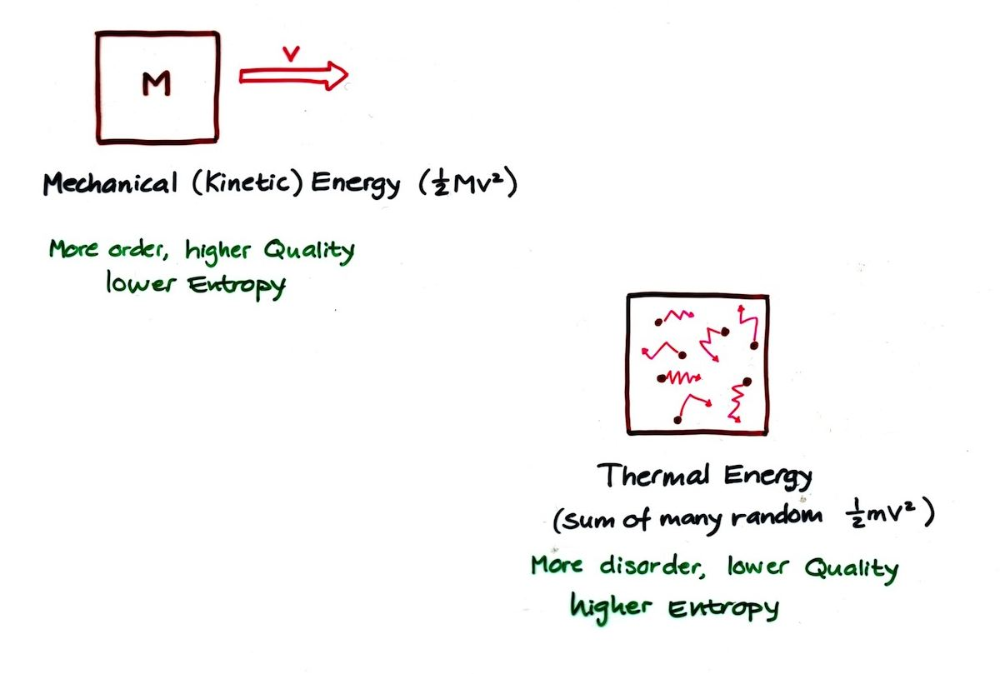
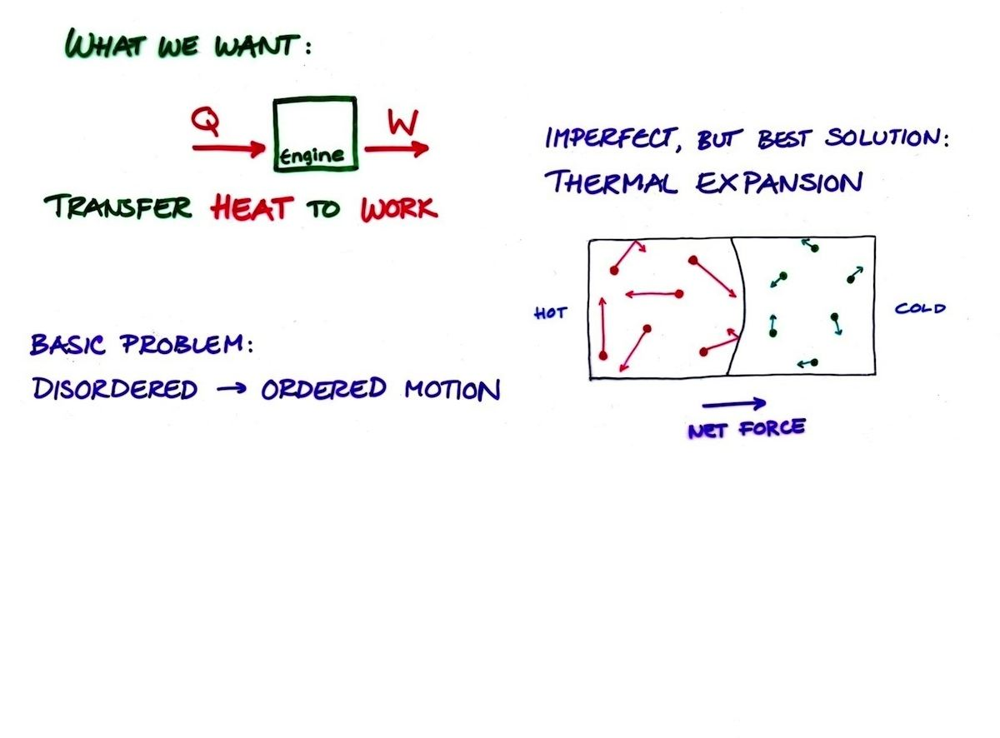
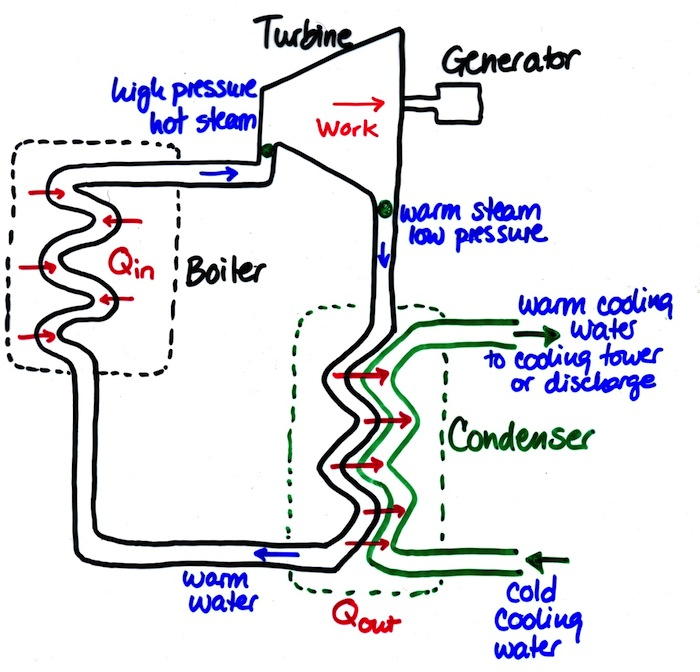
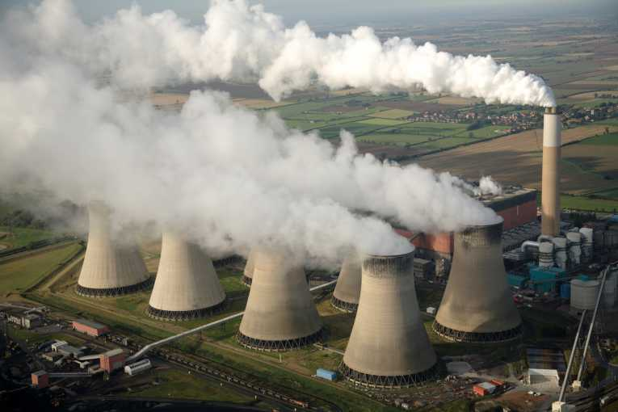
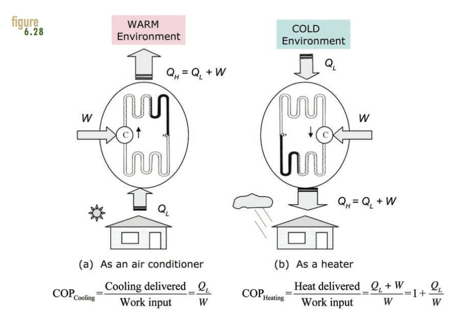

# Thermodynamics

## Fundamental Concepts
- Temperature
- Fahrenheit, Celsius, Kelvin Scale
- First Law of Thermodynamics
- Second Law of Thermodynamics

## Applied Concepts
- Carnot cycle heat engine
- Carnot refrigerator
- Carnot efficiency
- Coefficient of performance for refrigeration
- Coefficient of performance for heating

## Temperature
- Measure of the internal energy in a system or material
- This energy is the motion, vibration, or rotation of atoms and
  molecules

## Zeroth Law of Thermodynamics
- If two systems are each in thermal equilibrium with a third system,
  they are also in thermal equilibrium with each other.
- Real world example: Coffee gets cold, ice cream melts

## First Law of Thermodynamics
- Energy is conserved
- Energy cannot be created or destroyed
- "You can't get something for nothing"

## First Law Efficiency
- Most commonly used measure of efficiency
- Useful energy out divided by total energy in

## Second Law of Thermodynamics
- The amount of entropy (disorder) in a closed system always increases
- Heat flows spontaneously from hot to cold
- "You can't break even"

## Second Law Thermodynamic limit to heat engine
- Carnot derived the upper limit of efficiency for a heat engine
$$\eta = 1 - \frac{T_C}{T_H}$$
- This law dictates the maximum possible efficiency for power plants
- Some of the heat must be released into the environment

## Exploring the Carnot Equation

What is the efficiency of a carnot heat engine when

- T_C is near zero?
- T_H is very high?
- T_C and T_H are close to each other?

## Heat Engine Definition
- Heat engines convert thermal energy to mechanical kinetic energy

## Heat Engine Examples
- Coal power plant turbines
- Internal combustion engines

## Heat Engines
- The heat engine is a mathematical model
- Takes the heat (flow) between two thermal reservoirs and converts some of that heat to work
- Heat can come from combustion or natural sources of heat
- This conversion can never be 100 percent efficient because of the second law

## Heat Engines
- A heat engine is more efficient when it uses a wider temperature range between the hot and cold sides

## Heat Engine

## Quality

## Quality

## Carnot Heat Engine
- The most efficient heat engine possible uses a Carnot cycle
- Heat is used to expand a gas and do work and heat is removed during the compression of the gas.
- There are many other cycles used in steam generators and internal combustion engines

## Power plant

## Power plant

## Coefficient of Performance

## Maximum COP

For refrigeration
$$ COP_R = \frac{T_C}{T_H - T_C} $$

For a heat pump
$$ COP_{HP} = \frac{T_H}{T_H - T_C} $$

## What is the carbon difference for heat pump vs combustion

For high coefficients of performance and low carbon intensities of electricity, the carbon emitted to provide the same amount of heating in a home can be lower for an electric heat pump.

This is in contrast to resistive electric heating which emits more carbon than direct combustion because of the second law losses at the power plant.

