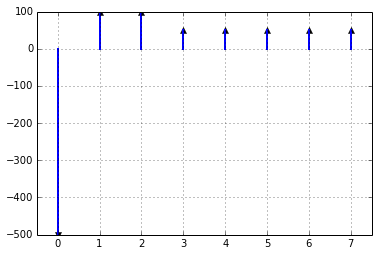

## Learning Objectives

- Calculate equivalent sums of money using discount rates

## Concepts
- Time Value of Money
- Equivalence and Comparison Principle
- Net Present Value (NPV)
- Future Value
- Discounting
- Discount rate
- Interest rate

## Equivalence principle
- Given a choice between money now and money later, most demand a larger
  value at a later date
- When someone is indifferent between sum 1 now and sum 2 at a fixed
  later date, the sums are considered equivalent
- This equivalence can be expressed using a discount rate

## Discount rate vs. Interest rate

- Discount rate usually refers to personal preferences
- Interest rate is usually a real rate charged by a bank

## Monthly vs. Yearly interest rates

- Many types of loans advertise a yearly interest rate, but charge
    interest monthly.
- The yearly interest rate is the APR or annual percentage rate
- To find the monthly rate divide this by twelve
- $i$ is the annual percentage rate
- $n$ is the number of periods in months

$$ FV = PV (1 + i/12)^{n} $$

## Cash flow diagrams

## NPV Spreadsheet Example
<!-- create a net present value calculation -->
<!-- show by hand and with NPV function -->

- Excel considers first value in the NPV function to be year 1

## Loan Spreadsheet Example

- You can arrive at a loan payment by trial and error in a spreadsheet.

## Learning Objectives

- Able to use the internal rate of return (IRR) to quantify an energy investment
- Able to use the capital recovery function (CRF) to estimate a loan
    payment
- Recognize cost of conserved energy (CCE) and  cost of conserved carbon

## Review

- Discounting
- Time Value of Money
- NPV

## Internal Rate of Return
- Tells us at what interest rate a cash flow has a net present value of
  zero
- We will look at this on a spreadsheet
- This doesn't have a closed-form solution
- Usually solved by a computer

# Inflation

## Inflation

- The cost of goods usually rises over time
- This rate is monitored by the [Consumer Price Index](http://www.bls.gov/cpi/)
- As prices rise, the value of money decreases

## Inflation

$$ 1 + r_0 = \frac{1+r}{1+f} $$

- $r_0$ is the effective rate of interest
- $r$ is the nominal rate of interest
- $f$ is the inflation rate

For small inflation rates,

$$ r_0 \approx r - f $$

## CRF Spreadsheet Example
<!-- show by hand and with PMT function -->
<!-- compare to calculator online -->

- Excel PMT
- Excel IRR

<!-- ## CRF Scripting Example -->
<!--  -->
<!-- &#45; np.pmt() -->
<!-- &#45; np.irr() -->

# Future Value
## Equivalence principle
- Given a choice between money now and money later, most demand a larger
  value at a later date
- When someone is indifferent between sum 1 now and sum 2 at a fixed
  later date, the sums are considered equivalent
- This equivalence can be expressed using a discount rate

## Discount Rate and Net Present Value
$$\textrm{Present Value (USD)} =
\frac
{\textrm{Future Amount (USD)}}
{(1 + \textrm{Discount Rate})^{\textrm{number of years in future}} }$$

$$P = \frac {F} {(1 + i)^{n} }$$

## Present Value Notation
Single payment
$$ PV = \frac{C}{(1+i)^n} $$

Stream of payments
$$
PV = C_0 +
        \frac{C_1}{1+i} +
        \frac{C_2}{(1+i)^2} +
        \cdots +
        \frac{C_N}{(1+i)^N}
$$

Compact notation
$$ PV = \sum_{n=0}^{N} \frac{C_n}{(1+i)^n}$$

## Discount rate vs. Interest rate

- Discount rate usually refers to personal preferences
- Interest rate is usually a real rate charged by a bank

## Monthly vs. Yearly interest rates

- Many types of loans advertise a yearly interest rate, but charge
    interest monthly.
- The yearly interest rate is the APR or annual percentage rate
- To find the monthly rate divide this by twelve
- $i$ is the annual percentage rate
- $n$ is the number of periods in months

$$ FV = PV (1 + i/12)^{n} $$

## Cash flow diagrams

## NPV Spreadsheet Example
<!-- create a net present value calculation -->
<!-- show by hand and with NPV function -->

- Excel considers first value in the NPV function to be year 1

## Loan Spreadsheet Example

- You can arrive at a loan payment by trial and error in a spreadsheet.

# Present Value

# Net Present Value

# Internal Rate of Return

## IRR
Finding the IRR is the equivalent of asking, here is a loan, what was
the interest rate you got?

# Capital Recovery Function

## Capital Recovery Factor
Suppose we make a loan.  We want to know what the yearly payment is so
that the present value of all payments is equal to the loan amount.

This formula allows us to calculate this payment.

$$CRF = \frac {i(1+i)^n}{(1+i)^n-1}$$

